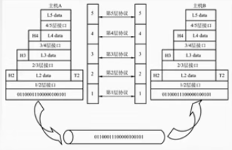

# 计算机网络体系结构

计算机网络的概念：

计算机网络是一个将分散的、具有独立功能的**计算机系统**，**通过通信设备与线路**连接起来，由功能完善的**软件**实现**资源共享和信息传递**的系统。

计算机网络是互连的，自治的计算机集合。

互连：互通互联。

自治：无主从关系。

计算机网络的功能：

1. 数据通信
2. 资源共享（硬件，软件，数据）
3. 分布式处理（多台计算机承担同一工作任务的不同部分）
4. 提高可靠性。
5. 负载均衡

等等

计算机网络的组成：

1. 组成部分 硬件，软件，协议（一系列规则和约定的集合）
2. 工作方式：
   1. 边缘部分（用户直接使用）包括了C/S方式和P2P方式。
   2. 核心部分 为边缘部分服务。
3. 功能组成
   1. 通信子网 实现数据通信
   2. 实现资源共享/数据处理

计算机网络的分类：

1. 按分布范围分为 广域网、城域网、局域网、个人区域网。
2. 按使用者分为公用网和专用网。
3. 按交换技术分为电路交换，报文交换，分组交换。
4. 按照拓扑结构可分为 总线型，星型，环型，网状型。
5. 按传输技术分为 广播式网络和点对点网络。

## 标准化工作

法定标准：权威机构指定的正式的，合法的标准：OSI标准。

事实标准：某些公司的产品竞争占据了主流后就成了事实上的标准：TCP/IP

## 网络的性能指标

速率：速率即数据率或称数据传输率或比特率。

比特 就是一位 0或1

连接在计算机网络上的主机在数字信道上传送数据位数的速率。

单位是b/s，kb/s， Mb/s, Gb/s， Tb/s

带宽：

(1) “带宽”原本指某个信号具有的频带宽度，即最高频率与最低频率之差，单位是赫兹(Hz)。
(2)计算机网络中，带宽用来表示网络的通信线路传送数据的能力，通常是指单位时间内从网络中的某一点到另一点所能通过的“最高数据率”。单位是“比特每秒”，b/s， kb/s, Mb/s, Gb/s。网络设备所支持的最高速度

吞吐量：

表示在单位时间内通过某个网络(或信道、接口)的数据量。单位b/s, kb/s， Mb/s等。

吞吐量受网络的带宽或网络的额定速率的限制。

### 时延（重要）：

指数据(报文/分组/比特流)从网络(或链路)的-端传送到另-端所 需的时间。也叫延迟或迟延。单位是s。

分为四种时延：

1. 发送时延
2. 传播时延
3. 排队时延
4. 处理时延：检错，找出口。

时延带宽积：

时延带宽积 = 传播时延 x 带宽。

时延带宽积又称**以比特为单位的链路长度**，即某段链路现在有多少比特。

往返时延 RTT：

从发送方发送数据开始，到发送方收到接收方的确认(接收方收到数据后立即发送确认)，总共经历的时延。

RTT越大，在收到确认之前，可以发送的数据就越多。

RTT 包括：

1. 往返传播时延 = 传播时延 * 2
2. 末端处理时间

### 利用率

1. 信道利用率 = $\frac{有数据通过的时间}{总的数据通过的时间}$
2. 网络利用率 信道利用率加权平均值。

## 网络分层

为什么要分层，我们先来看发送文件前要完成的工作。

1. 发起通信的计算机必须将数据通信的通路进行激活。
2. 要告诉网络如何识别目的主机。
3. 发起通信的计算机要查明目的主机是否开机，并且与网络连接正常。
4. 发起通信的计算机要弄清楚，对方计算机中文件管理程序是否已经做好准备工作。
5. 确保差错和意外可以解决。

这些问题实在太多了，所以我们使用大事化小小事化了的方法，把大问题分解成小问题，然后再各个层中去解决。

### 分层的基本原则

1. 各层之间相互独立，每层只实现一种相对独立的功能。
2. 每层之间界面自然清晰，易于理解，相互交流尽可能少。
3. 结构上可分割开。每层都采用最合适的技术来实现。
4. 保持下层对上层的独立性，上层单向使用下层提供的服务。
5. 整个分层结构应该能促进标准化工作。

### 为了分层需要提出的概念

1. 实体:第n层中的活动元素称为n层实体。同一层的实体叫对等实体。
2. 协议:为进行网络中的对等实体数据交换而建立的规则、标准或约定
   称为网络协议。[水平方向]
   1. 语法：规定传输数据的格式。
   2. 语义：规定所要完成的功能。
   3. 同步：规定各种操作的顺序。
3. 接口：上层使用下层服务的入口。
4. 服务：下层为相邻上层提供的功能调用。[垂直方向]

其他名词

- SDU服务数据单元:为完成用户所要求的功能而应传送的数据
- PCI协议控制信息:控制协议操作的信息。
- PDU协议数据单元:对等层次之间传送的数据单位。

### 网络分层概念总结

网络体系结构是从**功能**上描述计算机网络结构。

计算机网络体系结构坚称网络体系结构是**分层结构。**

每层遵守某个/些**网络协议**以完成本层功能。

计算机网络体系结构是计算机网络的**各层及其协议**的集合。

第n层在向n+1层提供服务时，此服务不仅包含第n层本身的功能，还包含由下层服务提供的功能。

仅仅在**相邻层**间有接口，且所提供的服务的具体实现细节对上一层完全屏蔽。

体系结构是**抽象**的，而实现是指能运行的一些软件和硬件。

### OSI网络模型

#### 应用层

所有能和用户交互产生网络流量的程序。

有 SMTP，FTP，HTTP等协议。

#### 表示层

用于处理在两个通信系统中交换信息的表示方式（语法和语义）

含有的功能有：

- 数据格式变换
- 数据加密解密
- 数据压缩和恢复

#### 会话层

 向表示层实体/用户进程提供**建立连接并在连接上有序地传输数据。这是会话，也是建立同步**。

功能：

- 建立，管理，终止会话
- 使用校验点可使会话在通信时效时从校验点/同步点继续恢复通信，实现数据同步。适用于传输大文件。

#### 传输层

负责主机中两个进程的通信，即端到端的通信。传输单位是报文段或用户数据报。

功能：

- 可靠传输与不可靠传输
- 差错控制
- 流量控制
- 复用分用，复用：多个应用层进程可同时使用下面运输层的服务。分用：运输层把收到的信息分别交付给上面应用层中相应的进程。

#### 网络层

主要任务是把分组从源端传到目的端，为分组交换网上的不同主机提供通信服务。网络层传输单位是数据报。

功能：

- 路由选择
- 流量控制
- 差错控制
- 拥塞控制

#### 数据链路层

主要任务是把网络层传下来的数据报组装成帧。数据链路层传输单位是帧。

功能：

- 封装成帧
- 差错控制
- 流量控制
- 访问（接入）控制，控制对信道的访问

#### 物理层

主要任务是在物理媒体上实现比特流的透明传输。物理层的传输单位是比特。

- 透明传输：指不管所传数据是什么样的比特组合，都应当能够在连路上传送。

功能：

- 定义接口特性
- 定义传输模式（单工，半双工，全双工）

- 定义传输速率
- 比特同步
- 比特编码

