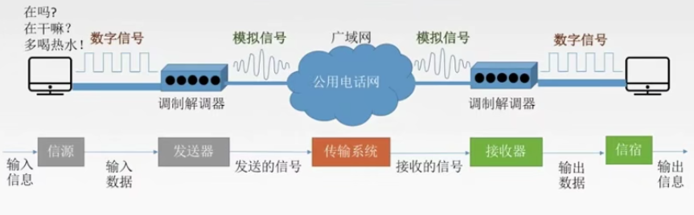
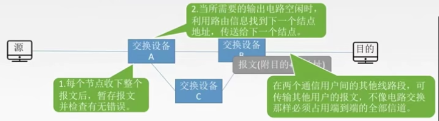

# 物理层

## 数据通信模型

可分为源系统，传输系统，目的系统。

数据通信相关术语：

- 数据data:传送信息的实体，通常是有意义的符号序列。
- 信号:数据的电气/电磁的表现，是数据在传输过程中的存在形式。
  - 数字信号/离散信号:代表消息的参数的取值是离散的。
  - 模拟信号/连续信号:代表消息的参数的取值是连续的。
- 信源：产生和发送数据的源头。
- 信宿：接收数据的终点。
- 信道：信号传输的媒介。一般用来表示向一个方向传送信息的介质，因此一条通信线路往往包含一条发送信道和接收信道。

### 设计通信系统的三个问题

#### 通信方式

从通信双方信息 交互方式看，可以有三种基本方式：

1. 单工信道：只有一个方向的通信而没有反方向的交互，仅需要一条信道。
2. 半双工信道：通信的双方都可以发送或接收信息，但任何-方都不能同时发送和接收，需要两条信道。
3. 全双工通信：通信双方可以同时发送消息和接收消息，需要两条信道。

#### 数据的传输方式

- 串行传输：将一个字符的八位二进制数按从低到高的顺序依次发送。速度慢，费用低，适合远距离。
-  并行传输：将表示一个字符的八个二进制位同时通过8条信道传输。速度快，费用高，适合近距离传输。

#### 实现同步的传输/通信方式

- 同步传输:在同步传输的模式下，数据的传送是以一个数据区块为单位，因此同步传输又称为区块传输。在传送数据时，需先送出1个或多个同步字符，再送出整批的数据。

  

 - 异步传输:异步传输将比特分成小组进行传送，小组可以是8位的1个字符或更长。发送方可以在任何时刻发送这些比特组，而接收方不知道它们会在什么时候到达。传送数据时，加一个字符起始位和一个字符终止位。

   

## 码元

   码元是指用一个**固定时长**的**信号波形**(数字脉冲)，代表不同离散数值的基本波形，是数

   字通信中数字信号的计量单位，这个时长内的信号称为k进制码元，而该时长称为码元宽

   度。当码元的离散状态有M个时(M大于2) ,此时码元为M进制码元。

   **1码元可以携带多个比特的信息量。**例如，在使用二进制编码时，只有两种不同的码元，一种代表0状态，另一种代表1状态。

   K进制码元，比如4进制码元即指码元的离散状态有4个4种高低不同的信号波形 00、01、 10、11，即两个比特位。

### 数字通信系统数据传输速率的两种表示方法

   速率也叫**数据率**，是指数据的**传输速率**，表示单位时间内传输的数据量。可以用码元传输速率和信息传输速率表示。

   1. 码元传输速率：别名码元速率、波形速率、调制速率、符号速率等，他表示单位时间内数字通信系统所传输的码元个数，单位是**波特 B**，1 波特表示数字通信系统每秒传输一个码元。

      数字信号有多进制和二进制之分，但**马元速率与进制数无关**，只和码元长度 T 有关。

      $$R_b = \frac{1}{T}(B)$$

   2. 信息传输速率：别名信息速率、比特率等，表示单位时间内数字通信系统传输的二进制码元个数( 即比特数），单位是比特/s（b/s）。

   若一个码元携带n bit的信息量，则M B的码元传输速率所对应的信息传输速率为 M * n bit/s/。

### 思考题1
某一数字通信系统传输的是四进制码元,4s传输了8000个码元，求系统的码元传输速率是多少？信息传输速率是多少？若另一通信系统传输的是十六进制码元,6s传输了7200个码元，求他的码元传输速率是多少?信息传输速率是多少?并指出哪个系统传输速率快?

1. 2000B，4000bit/s
2. 1200B，4800bit/s
3. 第二个系统更快。系统传输的是**比特流**，**通常比较的是信息传输速率**，所以传输十六进制码元的通信系统传输速率较快。

## 带宽（Bandwidth）

1. 模拟信号系统中：当输入的信号频率高或低到一定程度，使得系统的输出功率成为输入功率的一半时(即-3dB)，最高频率和最低频率间的差值就代表了系统的通频带宽，其单位为赫兹(Hz)。

2. 数字设备中：表示在单位时间内从网络中的某一点到另一点所能通过的“最高数据率" /单位时间内通过链路的数量，常用来表示网络的通信线路所能传输数据的能力。单位是比特每秒(bps)。

## 奈氏准则与香农定理

失真：

影响失真成都的因素：

1. 码元传输速率（越快越失真）
2. 传输距离
3. 噪声干扰
4. 传输媒体的质量

失真的一种现象：码间串扰

信道带宽是信道能通过的最高频率和最低频率之差。

3300 Hz - 300 Hz = 3000 Hz

码间串扰：**接收端**收到的**信号波形失去了码元之间清晰界限**的现象。

奈氏准则：

奈氏准则:在理想低通(无噪声，带宽受限)条件下，为了避免码间串扰，极限码元传输速率为2W Baud, W是信道带宽，单位是Hz。

1. 在任何信道中，码元传输速率是有上限的。若传输速率超过上限，就会出现严重的码间串扰问题，使接收方码元完全正确的识别成为不可能。
2. 信道的频带越宽(即能通过的信号高频分量越多)，就可以用更高的速率进行码元的有效传输。
3. 奈氏准则给出了码元传输速率的限制，但并没有对信息传输速率给出限制。
4. 由于码元的传输速率受奈氏准则的制约，所以要提高数据的传输速率，就必须设法使每个码元能携带更多的比特位的信息量，这就需要使用多元制解调方式。

例题：在无噪声情况下，若某通信链路的带宽为 3k Hz，采用 4 个相位，每个相位具有 4 种振幅的 QAM 调制技术，则该通信链路的最大数据传输率是多少？

2 * 3 * 4 = 24 kb/s

### 香农定理

**噪声**存在于所有的电子设备和通信信道中。由于噪声随机产生，它的瞬时值有时会很大，因此噪声会使接收端对码元的判决产生错误。但是噪声的影响是相对的，若信号较强，那么噪声影响相对较小。因此，**信噪比**就很重要。

信噪比 = 信号的平均功率/噪声的平均功率，常记为S/N，并用分贝(dB) 作为度量单位，即: 

 $$dB = 10log_{10}(S/N)$$

香农定理：在带宽受限且有噪声的信道中，为了不产生误差，信息的数据传输速率有上限值。

1. 信道的带宽或信道中的信噪比越大，则信息的极限传输速率就越高。
2. 对一定的传输带宽和- -定的信噪比，信息传输速率的上限就确定了。
3. 只要信息的传输速率低于信道的极限传输速率，就一定能找到某种方法来实现无差错的传输。
4. 香农定理得出的为极限信息传输速率，实际信道能达到的传输速率要比它低不少。
5. 从香农定理可以看出，若信道带宽 W 或信噪比 S/N 没有上限（不可能），那么信道的极限信息传输速率也没有上限。

例 电话系统的典型参数是信道带宽为3000Hz，信噪比为30dB，则该系统最大数据传输速率是多少?

由 30 dB 求出 S/N = 1000。

3000 * log~2~(1+1000) 约等于 30 kb/s

## 总结

如果二进制信号在信噪比为 127 的 4 k Hz 信道上传输，最大数据速率可达多少。

答：香农定理：28 kb/s， 奈氏准则：2*4 = 8 kb/s，所以最大数据速率为 8 kb/s.

## 编码与调制

基带信号与宽带信号

基带信号：将数字信号直接用两种不同的电压表示，再送到数字信道上去传输（基带传输）。来自信源的信号，像计算机输出的代表各种文字或图像文件的数据信号都属于基带信号。基带信号就是发出的**直接表达了要传输的信息的信号**，比如我们说话的声波就是基带信号。

宽带信号：将基带信号进行调制后形成的频分复用模拟信号，再传送到模拟信道上去传输（宽带传输）。把基带信号经过载波调制后，把信号的频率范围搬移到较高的频段以便在信道中传输( 即仅在一段频率范围内能够通过信道)。

在传输距离近的时候用基带传输方式，远距离用宽带传输方式。

**数据转为数字信号就是编码，转为数据就是调制。**

### 编码方式

1. 非归零编码：编码容易实现，但没有检错功能，且无法判断一个码元的开始和结束，以至于收发双方难以保持同步。
2. 曼彻斯特编码：前高后低为1，前低后高为0.（具体题目中可能不一样）
3. 差分曼彻斯特编码：同1异0.

4. 归零编码：信号在电平在一个码元之内都要恢复到零这种编码成编码的方式。

   

5. 反向不归零编码：信号电平翻转表示0，信号电平不变表示1.

   

6. 4B/5B 编码：比特流中插入额外的比特以打破一连串的0或1，就是用 5 个比特来编码 4 个比特的数据，之后再传给接收方，因此称为 4B/5B。编码效率为 80%。

### 数字数据调制为模拟信号

数字数据调制技术在发送端将数字信号转换为模拟信号，而在接收端将模拟信号还原为数字信号，分别对应于调制解调器的调制和解调过程。

QAM技术 = 调幅+调相，例题：

某通信链路的波特率是 1200 Baud，采用4个相位，每个相位有4中振幅的 QAM 调制技术，则该链路的信息传输速率是多少？

16种波形对应16种码元，也就是4进制码元。

传输速率 = 1200 * 4 = 4.8k

### 模拟数据编码为数字信号

计算机内部处理的是二进制数据，处理的都是数字音频，所以需要将模拟音频通过采样、量化转换成有限个数字表示的离散序列(即实现音频数字化)。最典型的例子就是对音频信号进行编码的脉码调制(PCM)，在计算机应用中，能够达到最高保真水平的就是PCM编码，被广泛用于素材保存及音乐欣赏，CD、 DVD以及我们常见的WAV文件中均有应用。它主要包括三步:抽样、量化、编码。

1. 抽样：对模拟信号周期性扫描，把时间上连续的信号变成时间上离散的信号。为了使所得的离散信号能无失真地代表被抽样的模拟数据，要使用采样定理进行采样: 
   $$f_{采样频率} \geq 2f_{信号最高频率}$$，因为如果不以两倍频率采样可能会刚好漏掉一半的波形。
2. 量化： 把抽样取得的电平幅值按照一定的分级标度转化为对应的数字值，并取整数，这就把连续地电平幅值转换为离散的数字量。
3. 编码：把量化的结果转换为与之对应的二进制编码。

### 模拟数据调制为模拟信号

为了实现传输的有效性，可能需要较高的频率。这种调制方式还可以使用频分复用技术，充分利用带宽资源。在电话机和本地交换机所传输的信号是采用模拟信号传输模拟数据的方式:模拟的声音数据是加载到模拟的载波信号中传输的。

## 数据交换方式

为什么要数据交换：

数据交换可分为：

电路交换，报文交换，分组交换。

### 电路交换：

电路交换：在数据传输期间，源结点与目的结点之间有一条由中间结点构成的专用物理连接线路，在数据传输结束之前，这条线路一直保持。

特点：独占资源，用户始终占用端到端的固定传输宽带，适用于远程批处理信息传输或系统间实时性要求高的大量数据传输的通信。

|                         电路交换优点                         |                         电路交换缺点                         |
| :----------------------------------------------------------: | :----------------------------------------------------------: |
|                          传输时延小                          |                        建立连接时间长                        |
|                   数据顺序传送，无失序问题                   | 线路独占，即使通信线路空闲，也不能供其他用户使用，信道使用率低。 |
| 实时性强，双方一旦建立物理通路，便可以实时通信，适用于交互式会话类通信 | 灵活性差，双方通路中的一点出了问题，必须重新拨号建立连接，不适应突发性通信。 |
| 全双工通信，没有冲突，通信双方有不同的信道，不会争用物理信道。 |               无数据存储能力，难以平滑通信量。               |
|                   适用于模拟信号和数字信号                   | 电路交换时，数据直达，不同类型，不同规格，不同速率的终端很难相互通信 |
|             控制简单，电路的交换设备和控制较简单             |     无法发现与纠正传输差错，难以在通信过程中进行差错控制     |

### 报文交换：

报文:报文(message)是网络中交换与传输的数据单元，即站点一次性要发送的数据块。 报文包含了将要发送的完整的数据信息，其长短很不一致，长度不限且可变。

报文交换的原理：无需在两个站点之间建立一条专用通路，其数据传输的单位是报文，传送过程中采用**存储转发**的方式。

报文交换优缺点：

|                             优点                             |                             缺点                             |
| :----------------------------------------------------------: | :----------------------------------------------------------: |
|      无需建立连接，无建立连接时延，用声可随时发送报文。      | 实时性差，不适合传送实时或交互式业务的数据。数据进入交换节点后要经历存储转发过程，从而引起转发时延。 |
|  动态分配线路，动态选择报文通过的最佳路径，可以平滑通信量。  |                      只适用于数字信号。                      |
| 提高线路可靠性，某条传输路径发生故障，可重新选择另一台路径传输。 | 由于报文长度没有限制，而每个中间结点都要完整地接收传来的整个报文，当输出线路不空闲时， 还可能要存储几个完整报文等待转发，要求网络中每个结点有较大的缓冲区。为了降低成本，减少结点的缓冲存储器的容量，有时要把等待转发的报文存在磁盘上，进一步增加了传送时延。 |
| 提高线路利用率，通信双方在不同的时间一段一段地部分占用这条物理通道，多个报文可共享信道。 |                                                              |
|       提供多目标服务：一个报文可同时发往多个目的地址。       |                                                              |
| 在存储转发中容易实现代码转换和速率匹配，甚至收发双方可以不同时处于可用状态。这样就便于类型、规格和速度不同的计算机之间进行通信。 |                                                              |

### 分组交换

分组：大多数计算机网络都不能连续地传送任意长的数据，所以实际上网络系统把数据分割成小块，然后逐块地发送，这种小块就称作分组(packet) 。

分组交换的原理：

分组交换与报文交换的工作方式基本相同，都采用存储转发方式，形式上的主要差别在于，分组交换网中要限制所传输的数据单位的长度，一般选128B。发送节点首先对从终端设备送来的数据报文进行接收、存储，而后将报文划分成一定长度的分组，并以分组为单位进行传输和交换。接收结点将收到的分组组装成信息或报文。

分组交换的优缺点：

|                             优点                             |                             缺点                             |
| :----------------------------------------------------------: | :----------------------------------------------------------: |
| 无建立时延，无需为通信双方预先建立一条专用通信线路，用户可随时发送分组。 | 尽管分组交换比报文交换的传输时延少，但仍存在转发时延，而且其结点交换机必须具有更强的处理能力。 |
| 线路利用率高，通信双方在不同的时间一段一-段地部分占有这条物理通道，多个分组可共享信道。 | 每个分组都要加控制信息，一定程度上降低了通信率，增加了处理的时间。。 |
| 简化了存储管理。因为分组的长度固定，相应的缓冲区的大小也固定，在交换结点中存储器的管理通常被简化为对缓冲区的管理，相对比较容易。 | 当分组交换采用数据报服务时，可能出现失序、丢失或重复分组，分组到达目的结点时，要对分组按编号进行排序等工作，增加了麻烦。若采用虚电路服务，虽无失序问题，但有呼叫建立、数据传输和虛电路释放三个过程。 |
| 加速传输，后一个分组的存储可以和前个分组的转发并行操作:传输一个分组比份报 文所需缓冲区小，减少等待发送时间。 |                                                              |
|     减少出错几率和重发数据量，提高可靠性，减少传输时延。     |                                                              |
|          分组短小，适用于计算机之间突发式数据通信。          |                                                              |

### 三种数据交换方式的应用场景：

1. 传送数据量大，且传送时间远大于呼叫时，选择**电路交换**。电路交换传输时延最小。
2. 当端到端的通路有很多段的链路组成时，采用**分组交换**传送数据更合适。
3. 从信道利用率上看，报文交换和分组交换优于电路交换，其中分组交换比报文交换的时延小，尤其适合于计算机之间的突发式数据通信。

### 分组交换的两种交换方式

- 数据报方式

  

  1. 源主机(A)将报文分成多个分组，依次发送到直接相连的结点(A)。
  2. 结点A收到分组后，对每个分组差错检测和路由选择，不同分组的下一跳结点可能不同。
  3. 结点 C 收到分组 P1 后，对分组 P1 进行差错检测，若正确则向A 发送 确认信息，A 收到 C确认后则丢弃分组。
  4. 所有分组到达主机B。

  - 数据报方式的特点：
    1. 数据报方式为网络层提供**无连接服务**。发送方可随时发送分组，网络中的节点可随时接受分组。（无连接服务：不事先为分组的传输确定传输路径，每个分组独立确定传输路径，不同分组传输路径可能不同）。
    2. 同一报文的不同分组到达目的节点时可能发生乱序，重复与丢失。
    3. 每个分组在传输过程中都必须携带源地址和目的地址，以及分组号。
    4. 分组在交换节点存储转发时，需要排队等待处理，这会带来一定的时延。当通过交换节点的通信量较大或网络发生拥塞时，这种时延会大大增加，交换节点还可根据情况丢弃部分分组。
    5. 网络具有冗余路径，当某一交换节点或一段链路出现故障时，可相应地更新转发表，寻找另一条路径的转发分组，对故障的适应能力强，适用于突发性通信，不适用于长报文、会话式通信。

- 虚电路方式

  虚电路将数据报方式和电路交换方式相结合，以发挥两者优点。

  

  

  虚电路：一条源主机到目的主机类似于电路的路径（逻辑连接），路径上所有节点都要维持这条虚电路的建立，都维持一张虚电路表，每一项记录了一个打开的虚电路的信息。

  

  1. 虚电路方式为网络层提供有连接服务。源节点与目的节点之间建立一条逻辑连接，而非实际物理连接。
  2. 一次通信的所有分组都通过虚电路顺序传送，分组不需携带源地址、目的地址等信息，包含虚电路号，相对数据报方式开销小，同-报文的不同分组到达目的结点时不会乱序、重复或丢失。
  3. 分组通过虚电路上的每个节点时，节点只进行差错检测，不需进行路由选择。
  4. 每个节点可能与多个节点之间建立多条虚电路，每条虚电路支持特定的两个端系统之间的数据传输，可以对两个数据端点的流量进行控制，两个端系统之间也可以有多条虚电路为不同的进程服务。
  5. 致命弱点：当网络中的某个节点或某条链路出故障而彻底失效时，则所有经过该节点或该链路的虚电路将会遭到破坏，需要重新建立连接。

### 总结

|                    |                         数据报服务                         |                         虚电路服务                         |
| :----------------: | :--------------------------------------------------------: | :--------------------------------------------------------: |
|     连接的建立     |                            不用                            |                            必须                            |
|      目的地址      |                 每个分组都有完整的目的地址                 | 仅在建立连接阶段使用，之后每个分组使用长度较短的虚电路信号 |
|      路由选择      |               每个分组独立进行路由选择和转发               |            属于同一虚电路的分组按照同一路由转发            |
|      分组顺序      |                     不保证分组有序到达                     |                          保证有序                          |
| 对网络故障的适应性 |            不保证可靠通信，可靠性由用户主机保证            |                      可靠性由网络保证                      |
| 对网络故障的适应性 | 出故障的节点丢失分组，其他分组路径选择发生变化，可正常传输 |           所有经过故障节点的虚电路都不能正常工作           |
| 差错控制和流量控制 |       由用户主机进行流量控制，不保证数据报的可靠性。       |           可由分组交换网负责，也可由用户主机负责           |

  ## 物理层传输介质

传输介质也称传输媒体/传输媒介，它就是数据传输系统中在发送设备和接收设备之间的物理通路。

**传输媒体不是物理层**：传输媒体在物理层的下面，因为物理层是体系结构的第一层，因此有时称传输媒体为0层。**在传输媒体中传输的是信号，但传输媒体并不知道所传输的信号代表什么意思**，但**物理层规定了电气特性**，因此能够识别所传送的比特流。

传输介质：

1. 导向性传输介质 -> 电磁波被导向沿着固体媒介传播
2. 非导向性传播介质 -> 自由空间，介质可以是空气、真空、海水等。

### 导向性传输介质

1. 双绞线：双绞线是古老、又最常用的传输介质，它由两根采用一-定规则并排绞合的、相互绝缘的铜导线组成。

   

   为了进一步提高抗电磁干扰能力，可在双绞线的外面再加上-一个由金属丝编织成的屏蔽层，这就是屏蔽双绞线(STP)， 无屏蔽层的双绞线就称为非屏蔽双绞线(UTP)

   

   

   双绞线价格便宜，是最常用的传输介质之一，在局域网和传统电话网中普遍使用。模拟传输和数字传输都可以使用双绞线，其通信距离一般为几公里到数十公里。距离太远时，对于模拟传输，要用放大器放大衰减的信号:对于数字传输，要用中继器将失真的信号整形。

2. 同轴电缆：同轴电缆由**导体铜质芯线、绝缘层、网状编织屏蔽层和塑料外层**构成。按特性阻抗数值的不同，通常将同轴电缆分为两类: 50Q同轴电缆和750同轴电缆。其中，500同轴电缆主要用于传送基带数字信号，又称为**基带同轴电缆**，它在局域网中得到广泛应用: 75Q同轴电缆主要用于传送宽带信号，又称为**宽带同轴电缆**，它主要用于有线电视系统。

   

   同轴电缆与双绞线：由于外导体屏蔽层的作用，同轴电缆抗干扰特性比双绞线好，被广泛用于传输较高速率的数据，其传输距离更远，但价格较双绞线贵。

3. 光纤：光纤通信就是利用光导纤维(简称光纤)传递光脉冲来进行通信。有光脉冲表示1，无光脉冲表示0。而可见光的频率大约是10^8^MHz， 因此光纤通信系统的带宽远远大于目前其他各种传输媒体的带宽。光纤主要由**纤芯(实心的! )和包层**构成，光波通过纤芯进行传导，包层较纤芯有较低的折射率。当光线从高折射率的介质射向低折射率的介质时,其折射角将大于入射角。因此，如果入射角足够大，就会出现**全反射**，即光线碰到包层时候就会折射回纤芯、这个过程不断重复，光也就沿着光纤传输下去。

   

   超低损耗，传送距离超远。

   

   

|          |                定义                |          光源          |           特点           |
| :------: | :--------------------------------: | :--------------------: | :----------------------: |
| 单模光纤 | 一种在横向模式直接传输光信号的光纤 | 定向性很好的激光二极管 |  衰耗小，适合远距离传输  |
| 多模光纤 |     有多种传输光信号模式的光纤     |       发光二极管       | 容易失真，适合近距离传输 |

​	光纤的特点：

1. 传输损耗小，中继距离长，对远距离传输特别经济
2. 抗雷电和电磁干扰性能好
3. 无串音干扰，保密性好，也不易被窃听或截取数据
4. 体积小，重量轻

### 非导向性传输介质

1. 无线电波：信号向所有方向传播。具有较强的穿透能力，可传播远距离，广泛用于通信领域。（手机等）

2. 微波 ：信号沿着固定方向传播。微波通信频率较高、频段范围宽，因此数据率很高。

   1. 地面微波接力通信

   2. 卫星通信

      

3. 红外线，激光：信号沿着固定方向传播。把要传输的信号分别转换为各自的信号格式，即红外信号和激光信号再在空间中传播。