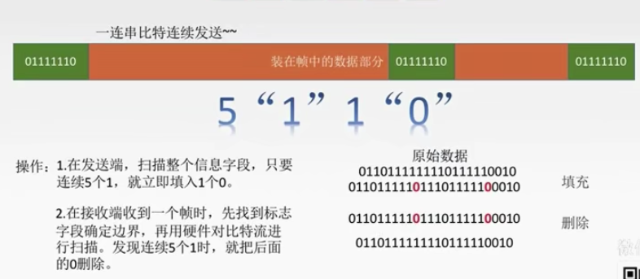
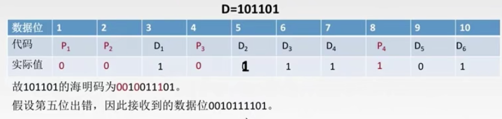
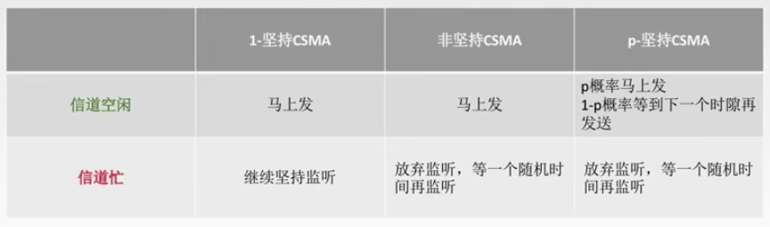
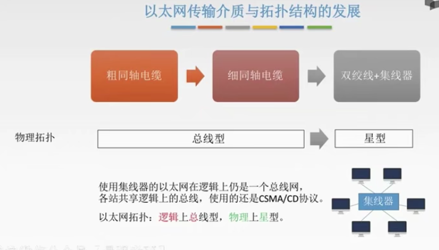
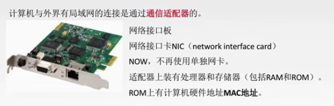
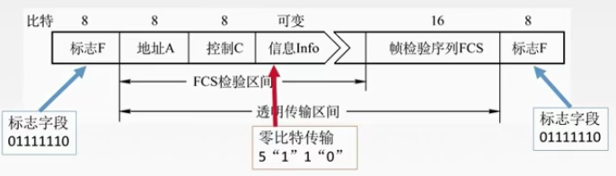

[toc]

# 数据链路层

1. 链路层的功能
2. 链路层的两桶信道
3. 局域网与广域网
4. 链路层的设备

## 数据链路层的研究思想

结点：主机、路由器

链路：网络中两个节点之间的物理通道，链路的传输介质主要有双绞线、光纤、和微波。分为有线链路，无线链路。

数据链路：网络中两个节点之间的逻辑通道，把视线控制数据传输协议的硬件和软件加到链路上就构成数据链路。

帧：链路层的协议数据单元，封装网络层数据报。

数据链路层负责通过一条链路从一个结点向另一个物理链路直接相连的相邻结点传送数据报。

数据链路层在物理层提供的服务基础上==向网络层提供服务 其最基本的服务是将源自网络层来的数据==可靠==地传输到量临界点的目标机网络层。其主要作用是==加强物理层传输原始比特流的功能==，将物理层提供的可能出错的物理连接改造为==逻辑上无差错的数据链路==，使之对网络层表现为一条无差错的链路。

功能一：为网络层提供服务：

- 无确认无连接服务。通信质量好，有线传输链路。
- 有确认无连接服务。通信质量差的无线传输链路。
- 有确认有连接服务。通信质量差的无线传输链路。

不存在有连接无确认的，有连接就一定有确认。

功能二：链路管理，即连接的建立，维持释放。

功能三：组帧

功能四：流量控制。（限制发送方）

功能五：差错控制（帧错/位错）

### 封装成帧

封装成帧就是在一段数据的前后部分添加首部和尾部，这样就构成了一个帧。接收端在收到物理层上交的比特流后，就能根据首部和尾部的标记，从收到的比特流中识别帧的开始和结束。

帧同步：==接收方==应当能从接收到的二进制比特流中区分出帧的起始和终止。

$帧的数据部分 \leq 最大传送单元（MTU）$

组帧的四种方法：

- 字符计数法
- 字节填充法
- 零比特填充法
- 违规编码法

### 透明传输

透明传输是指不管所传数据是什么样的比特组合，都应当能够在连路上传送。因此，链路层就“看不见”有什么妨碍传输数据的东西。

当所传数据中的比特组合恰巧与某一个控制信息完全一样时，就必须采取适当的措施，使收方不会将这样的数据误认为是某种控制信息。这样才能保证数据链路层的传输是透明的。

#### 字符计数法

痛点：鸡蛋放在一个篮子里。万一首部出错后果是灾难性的。

#### 字符填充法

在错误的结束符前添加转义字符 ESC。

#### 零比特填充法

保证了透明传输，在传送的比特流中可以传送任意比特组合，而不会引起帧边界的判断错误。

#### 违规编码法

利用了曼彻斯特编码一定会前高后低或前低后高的编码，所以我们使用高高和低低来定界帧的起始和终止。

由于字节计数法的脆弱性，及字符填充法填充实现上的复杂性和不兼容性，目前普遍使用帧同步的办法是比特填充和违规编码法。

### 差错控制

差错从何而来？

概括来说，传输中的差错都是由于噪声引起的。

1. 全局性：由于线路本身电气特性所产生的的随机噪声（热噪声），是信道固有的，随机存在的。

   解决办法：提高信噪比来减少或避免干扰。（对传感器下手）

2. 局部性：外界特定的短暂原因所造成的的冲击噪声，是产生差错的主要原因。

   解决办法：通常利用编码技术来解决。

差错控制（比特错）

检错编码：

1. 奇偶校验码
2. 循环冗余码CRC。

纠错编码：海明码

数据链路层编码和物理层的数据编码与调制**不同**。物理层编码针对的是单个比特，解决传输过程中比特的同步等问题，如曼彻斯特编码。而数据链路层的编码针对的是一组比特，它通过冗余码的技术实现一组二进制比特串在传输过程是否出现了差错。

冗余编码：

在数据发送之前，先按某种关系附加上一定的冗余位，构成一个符合某一规则的码字后 再发送。当要发送的有效数据变化时，相应的冗余位也随之变化，使码字遵从不变的规则。接收端根据收到码字是否仍符合原规则，从而判断是否出错。

#### 奇偶校验码

采用奇校验（首位加一位0或1，使得数据中1的总个数有奇数个）

采用偶校验（首位加一位0或1，使得数据中1的总个数有偶数个）

只能检测出奇数个比特错误，检错能力为 50%。

#### CRC 循环冗余码

计算步骤：

1. 加0（假设生成多项式的阶为 r，加 r 个0）
2. 模二除法（同 0 异 1）。数据加 0 后除以多项式，余数为冗余码 / FCS / CRC校验码的比特序列。 

10011 = X^4^ +  X^1^ + X^0^ 阶为 4。

1101 0110 11 0000 / 10011 = 1100 0010 000 ... 1110 余数 — FCS

最终发送数据为 1101 0110 11 1110

把收到的每一个帧都除以同样的除数，然后检查得到余数 R.

1. 余数为0，判定这个帧没有差错，接受。
2. 余数不为0，判断这个帧有差错，丢弃

FCS 的生成以及接收端的 CRC 校验都是由==硬件==实现，处理很迅速，因此不会延误数据的传输。

在数据链路层仅仅使用循环冗余检验CRC差错检测技术，只能做到对帧的==无差错接收==，即“凡是接收端数据链路层接受的帧，我们都能以非常接近于1的概率认为这些帧在传输过程中没有产生差错”。接收端丢弃的帧虽然曾收到了，但是最终还是因为有差错被丢弃。“ 凡是接收端数据链路层接收的帧均无差错”。

可靠传输：数据链路层发送端发送什么，接收端就收到什么。

链路层使用 CRC 检验，能实现无比特差错的传输，但这还不是可靠传输。

#### 纠错编码：海明码

可以发现双比特错，只能纠正单比特错。

##### 处理过程:

1. 确定校验码位数 r。

##### 校验码位数的确定:

假定数据位是 k,校验码是 r 位,则故障字位数也是 r 位.r 位故障字所能表示的状态最多是 2^r^,**每种状态可用来说明一种出错情况**.

##### 如果只有一位出错

* 数据中某一位出错(n种可能)
* 校验码中有一位错误(k种可能)
* 无错(1种可能)

显然==最多有1+n+k种情况==,那么我们首先==假定最多有一位出错==,则 r 和 k 必须满足如下关系

$2^r \geq k + r +1$

 比如我们现在要发送 D = 101101 

$ D = 101101 $

$k = 6$

解不等式
$$
2^r \geq 6 + r + 1 \\
得 r \geq 4
$$
所以海明码应该有 6 + 4 = 10 位。

##### 海明码的分组

**基本思想**

k 位数据位和 r 位校验位按某种方式排列为一个 (k + r) 位的码字,将该字中每个出错位的位置与故障字的数值建立关系,通过故障字的值确定该码字中哪一位发生了错误,并将其取反进行纠正.

于是可得出规则如下

* ==规则1:若故障字每位都是0,则表示没有发生故障==
* ==规则2:若故障字中有且仅有一位是1,则表示校验位中有一位出错,因而不需要纠正==
* ==规则3: 若故障字中有多个1,则表示有一个数据位出错,其在码字中的出错位置有故障字的数值来确定.纠正时只要将出错位取反即可==

我们现在用一个 6 位数据来使用以上规则进行纠错

* 根据规则1:故障字是0000表示无错
* 根据规则2:故障字只可能是0001,0010,0100,1000也就是 2^n^ 的位置,将这四种状态分别代入校验位中可知校验位在码字的1,2,4,8位。
* 根据规则3:将其他多位位1的故障字依次表示数据位M~1~M~8~发生错误的情况.因此数据位M~1~M~6~分别位于码字中的0011(3), 0101(5), 0110(6), 0111(7), 1001(9), 1010(10), 排列顺序就是 M~6~M~5~P~4~M~4~M~3~M~2~P~3~M~1~P~2~P~1~==这里的是逻辑顺序,在计算机的物理顺序中M和P是分开的==。

这样我们就可以得到故障字 S = S~4~S~3~S~2~S~1~ 的各个==状态和出错情况的对应关系表==。

* 分组完成后,就可以对每组采用相应的奇偶校验,以得到一个相应的一个校验位。

* 假定我们采用偶校验(去校验位Pi ,使对用组中有偶数个 1),则得到校验位与数据位之间存在如下关系:

  这里解释一下为什么P~1~对应了1245,==通过根据规则 3==我们不难发现在3,5,7,9,11的码字位置上出错的时候用到了 P~1~ 的校验位,所以对应位置的1, 2, 4, 5 需要通过 P~1~ 来进行校验,其余校验位同理。

$$
0 = P_1 \bigoplus M_1\bigoplus{M_2}\bigoplus{M_4}\bigoplus{M_5} \\
0 = P_2 \bigoplus M_1\bigoplus{M_3}\bigoplus{M_4}\bigoplus{M_6} \\
0 = P_3 \bigoplus M_2\bigoplus{M_3}\bigoplus{M_4} \\
0 = P_4 \bigoplus M_5\bigoplus{M_6}\bigoplus{M_7}\\
\left\{
\begin{aligned}
P_1 = 0 \\
P_2 = 0 \\
P_3 = 0 \\
P_4 = 1 
\end{aligned}
\right.
$$

再执行一次：
$$
P_1 \bigoplus M_1\bigoplus{M_2}\bigoplus{M_4}\bigoplus{M_5} \\
P_2 \bigoplus M_1\bigoplus{M_3}\bigoplus{M_4}\bigoplus{M_6} \\
P_3 \bigoplus M_2\bigoplus{M_3}\bigoplus{M_4} \\
P_4 \bigoplus M_5\bigoplus{M_6}\bigoplus{M_7}\\
$$
得到纠错位 0101 对应十进制 5， 所以得到了第五位出错的结论。

### 流量控制与可靠传输机制

较高的发送速度和较低的接收能力的不匹配，会造成传输出错，因此流量控制也是数据链路层的一项重要工作。

**链路层的流量控制是点对点的，而传输层的流量控制是端到端的。**

数据链路层流量控制手段：接收端收不下就不回复确认。

传输层流量控制手段：接收端给发送端一个窗口公告。

流控的方法

1. 停止-等待协议 发送窗口大小 = 1，接收窗口大小 = 1

   每发送完一个帧就停止发送，等待对方的确认，在收到确认后再发送下一个帧。

   

2. 滑动窗口协议：

   1. 后退 N 帧协议（GBN）发送窗口大小 > 1，接收窗口大小 = 1
   2. 选择重传协议（SR） 发送窗口大小 > 1，接收窗口大小 > 1

   

可靠传输：发送端发什么，接收端收什么。

流量控制：控制发送速率，使接收方有足够的缓冲空间来接收每一个帧。

滑动窗口：

- 流量控制（收不下就不给确认，想发也发不了）

- 可靠传输（发送方自动重传）

#### 停止-等待协议

停止等待协议究竟在哪一层？以前是在链路层，现在在传输层。

1. 为什么要有停止-等待协议？

   除了比特出错，底层通道还会出现丢包问题。为了实现流量控制

2. 研究停等协议的前提？

   虽然现在常用全双工通信方式，但为了讨论问题方便，仅考虑一方发送数据(发送方)，一方接收数据(接收方)。
   因为是在讨论可靠传输的原理，所以并不考虑数据是在哪-一个层次上传送的。

   停止-等待就是每发送一个分组就停止发送，等待对方确认，在收到确认后再发送下一个分组。

3. 停等协议几种应用情况

   1. 无差错情况

      

      每发送一个数据帧就停止并等待，因此用 1 bit 来编号就足够。

   2. 有差错：数据帧丢失或检测到帧出错。

      

      超时计时器：每次发送一个帧就会启动一个计时器。

      超时计时器设置的重传时间应当比帧传输的平均 RTT 更长一些。

      注意：**1. 发送完一个帧后，必须保留它的副本。2 数据帧和确认帧必须编号。**

   3. 有差错：ACK 丢失

      

   4. 有差错：ACK 迟到

      

停止等待协议性能分析：

简单，但是信道利用率太低。

信道利用率 $ U = \frac{T_D}{T_D + RTT + T_A}$

信道利用率：发送方在一个发送周期内，有效地发送数据所需的时间占整个发送周期的比率。

U = （L / C ) / T

L : T 内发送 L 比特数据。

C ：发送方数据传输率。

T：发送周期——从开始发送数据，到收到第一个确认帧为止。

信道吞吐率 = 信道利用率 * 发送方的发送速率

$$
80\% = \frac{L/4}{L/4 + 2 * 30ms} \\
= \frac{L}{L + 2 * 30ms * 4kb/s} \\
L = 960bit
$$

#### 后退 N 帧协议 （GBN）

停止等待协议太闲了，会造成资源浪费。

- 必须增加序号范围。
- 发送方需要缓存多个分组。

后退 N 帧协议的滑动窗口

发送窗口：发送方维持一组连续地允许发送的帧的序号。

接收窗口：接收方维持一组连续地允许接收帧的序号。

GBN 发送方必须相应的三件事

1. 上层的调用

   上层要发送数据时，发送方先检查发送窗口是否已满，**如果未满**，则产生一个帧并将其发送，**如果窗口已满**，发送方只需将数据返回给上层，暗示上层窗口已满。上层等一会再发送。( 实际实现中，发送方可以缓存这些数据，窗口不满时再发送帧)。

2. 收到了一个 ACK

   GBN协议中，对 n 号帧的确认采用==累积确认==的方式，标明接收方已经收到 n 号帧和它之前的全部帧。

3. 超时事件

   协议的名字为后退N帧 / 回退N帧，来源于出现丢失和时延过长帧时发送方的行为。就像在停等协议中一样，定时器将再次用于恢复数据帧或确认帧的丢失。如果出现超时，发送方重传所有已发送但未被确认的帧。

GBN 接收方要做的事：

- **如果正确收到 n 号帧**，并且按序，那么接收方为 n 帧发送一个ACK，并将该帧中的数据部分交付给上层。
- **其余情况都丢弃帧**，并为最近按序接收的帧重新发送ACK。接收方无需缓存任何失序帧，只需要维护一个信息: expectedseqnum (下一个按序接收的帧序号)。

运行中的GBN实例

出现超时：发送方重传所有已发送但未被确认的帧。

滑动窗口长度：

==窗口长度可以无限吗？==

不可以，若采用 n 个比特对帧编号，那么发送窗口的尺寸W~T~ 应满足：$1 \leq W_T \leq 2^n - 1$。因为如果发送窗口过大，就会导致接收方无法区别新帧和旧帧。

##### 重点总结

1. 累计确认（偶尔捎带确认）。
2. 接收方只按顺序接收帧，不按序直接丢弃。
3. 确认序列号最大的，按序到达的帧。
4. 发送窗口最大为 2 ^n^ - 1, 接收窗口大小为 1。

因为累积确认，所以 1 是确认到的。所以只要重发 4 帧。

##### GBN 协议性能分析

优点：因连续发送数据帧而提高了信道利用率。

缺点：在重传时必须把原来已经正确传送的数据帧重传，使传送效率降低。

选择重传协议来解决 GBN 的缺点。

#### 选择重传协议

可不可以只重传出错的帧？

解决办法：设置单个确认，同时加大接收窗口，设置接收缓存，缓存乱序到达的帧。

选择重传协议的滑动窗口：

SR 发送方必须响应的三件事：

1. 上层的调用

   从上层收到数据后，SR发送方检查下一个可用于该帧的序号，如果序号位于发送窗口内，则发送数据帧；否则就像GBN一样，要么将数据**缓存**，要么**返回给上层之后再传输。**

2. 收到了一个 ACK

   如果收到ACK，加入该帧序号在窗口内，则 SR 发送方将那个被确认的帧标记为已接收。如果该帧序号是窗口的下界(最左边第一个窗口对应的序号)，则窗口向前移动到具有最小序号的未确认帧处。如果窗口移动了并且有序号在窗口内的未发送帧，则发送这些帧。

3. 超时事件

   每个帧都有自己的定时器，一个超时事件发生后**只重传一个帧**。

SR 接收方要做的事：

来者不拒（窗口内的帧）

SR接收方将**确认一个正确接收的帧**而==不管其是否按序==。失序的帧将被==缓存==，并返回给发送方一个该帧的确认帧**[收谁确认谁]**，直到所有帧(即序号更小的帧)皆被收到为止，这时才可以将一批帧按序交付给上层，然后**向前移动滑动窗口**。

如果收到了窗口序号外（小于窗口下界）的帧，就返回一个 ACK。其他情况就忽略该帧。

##### 运行中的 SR 实例

滑动窗口可以长度无限吗？

不可以。发送窗口最好等于接收窗口。（大了会溢出，小了没意义）

$W_{Tmax} = W_{Rmax} = 2^{n-1}$

##### SR 协议总结

1. 对数据帧逐一确认，收一个确认一个。
2. 只重传出错帧。
3. 接收方有缓存。
4. 窗口长度有限 $W_{Tmax} = W_{Rmax} = 2^{n-1}$。

0,2 超时，3没超时，所以不用重传。

答案为 2。

## 传输数据使用的两种链路

- 点对点链路

  两个相邻节点通过一个链路相连，没有第三者。应用：PPP协议，常用于广域网。

- 广播式链路

  所有主机共享通信介质。应用：早期的总线以太网，无限局域网，常用于局域网。典型拓扑结构：总线型、星型（逻辑总线型）。

## 介质访问控制

介质访问控制就是采取一定的措施，使得两对节点之间的通信不会发生互相干扰的情况。

### 信道划分介质访问控制

信道划分介质访问控制：将使用介质的每个设备与来自同一信道上的其他设备的**通信隔离开**，把==时域和频域资源==合理地分配给网络上的设备。

把一条广播信道逻辑上分成，几条用于两个节点之间通信的互不干扰的子信道，也就是把==广播信道变为点对点信道。==

#### 频分多路复用 FDM

用户在分配到一定的频带后，在通信过程中自始至终都占用这个频带。**频分复用的所有用户在同样的时间占用不同的带宽资源。**

#### 时分多路复用 TDM

将时间划分为一段段等长的时分复用帧，TDM帧。每一个时分复用的用户在每一个TDM帧中占用固定序号的时隙，所有用户轮流占用信道。

- 频分复用——并行
- 时分复用——并发导致有可能造成效率太低。

改进的时分复用——统计时分复用 STDM

被挡文字为：按需分配

统计时分复用（Statistical Time Division Multiplexing）是一种根据用户实际需要动态分配线路资源的时分复用方法。只有当用户有数据要传输时才给他分配线路资源，当用户暂停发送数据时，不给他分配线路资源，线路的传输能力可以被其他用户使用。采用统计时分复用时，每个用户的数据传输速率可以高于平均速率，最高可达到线路总的传输能力。

时分复用是指将时间分成若干个时隙（time slot），每个时隙对应一个信道。如果该信道被某特定用户固定使用，如传统电路交换网中。也就是说不管有没有信息传送，该信道都不能被其他用户使用。如果该信道能被多用户复用，则为统计时分复用。统计时分复用有两种方式：面向连接的虚电路方式和面向无连接方式。如ATM网络就是前者，IP网络就是后者。

统计时分复用也叫异步时分复用：将所需传输的信息分成小块，附加标记。同一路信号可以占用同一桢中的不同时隙，不同路的信号根据标记加以区分。按照分组中的路由标记寻找出线。标志化信道异步时分多路复用（ATDM，Asynchronism Time-Division Multiplexing）技术，也叫做统计时分多路复用技术（STDM，Statistic Time-Division Multiplexing）。指的是将用户的数据划分为一个个数据单元，不同用户的数据单元仍按照时分的方式来共享信道；但是不再使用物理特性来标识不同用户，而是使用数据单元中的若干比特，也就是使用逻辑的方式来标识用户。

这种方法提高了设备利用率，但是技术复杂性也比较高，所以这种方法主要应用于高速远程通信过程中，例如，异步传输模式ATM。

#### 波分多路复用 WDM

#### 码分多路复用 CDM

码分多址（CDMA）是码分复用的一种方式。

1个比特分为多个码片/芯片（chip），每一个站点被指定一个唯一的 m 位的芯片序列。

发送 1 时站点发送芯片序列，发送 0 时发送芯片序列反码。

如何不打架：多个站点同时发送数据的时候，要求各个站点芯片序列相互正交（每个码位相乘再累计，最后除以总的位数，要求商为0）。

如何合并：各路数据在信道中被线性相加（对应位相加）。

如何分离：合并的数据和源站规格化内积。

#### ALOHA 协议 （不听就说）

纯 ALOHA 协议思想：不监听信道，不按时间槽发送，随机重发。==想发就发==

- 冲突如何检测？

  如果发生冲突，接收方在就会检测出差错，然后不予确认，发送方在一定时间内收不到就判断发生冲突。

- 冲突如何解决？

  超时后等待一随机时间在重传。

##### 时隙 ALOHA 协议

时隙 ALOHA 协议的思想：把时间分成若干个相同的时间片，所有用户在时间片开始时刻同步介入网络信道，若发生冲突，则必须等到下一个时间片开始时刻再发送。目的是==控制想发就发的随意性==

关于 ALOHA 要知道的事

1. 纯 ALOHA 比时隙 ALOHA 吞吐量更低，效率更低。
2. 纯 ALOHA 协议想发就发，时隙 ALOHA 只有在时间片段开始时才能发。

#### CSMA 协议 （先听再说）

发送帧之前，监听信道。

##### 1-坚持CSMA

如果一个主机要发送消息，那么它先监听信道。

==空闲则直接传输，不必等待。==

==忙则一直监听，直到空闲马上传输==

如果有冲突（一段时间内未收到肯定回复），则等待一个随机长的时间再监听，重复上述过程。

优点：只要媒体空闲，站点就马上发送，避免了媒体利用率的损失。

缺点：如果有两个或两个以上的站点要发送数据，则冲突不可避免。‘

##### 非坚持CSMA

非坚持指的是对于监听信道**忙**之后就不继续监听。

非坚持 CSMA 思想：

如果一个主机要发送消息，那么它先监听信道。

==空闲则直接传输，不必等待。==

==忙则等待一个随机的时间之后再进行监听。==

优点：采用随机的重发延迟时间可以减少冲突发生的可能性。

缺点：可能存在大家都在延迟等待的过程中，使得媒体仍可能处于空闲状态，媒体使用率降低。

##### p-坚持CSMA

p-坚持指的是对于监听信道空闲的处理。

p-坚持CSMA思想：

如果一个主机要发送消息，那么它先监听信道。

==空闲则以 p 概率直接传输，不比等待；概率 1-p 等待到下一个时间槽再传输。==

==忙则等待一个随机的时间之后再进行监听。==

优点：既能像非坚持算法那样减少冲突，又能像 1- 坚持算法那样减少媒体空闲时间的这种方案。

缺点：发生冲突后还是要坚持把数据帧发送完，造成了浪费。

#### 三种 CSMA 对比总结

#### CSMA/CD 先听再说，边听边说

CS:载波监听，每个站在发送数据之前以及发送数据时都要检测一下总线上是否有其他计算机在发送数据。应用于总线型网络。

CD：碰撞检测（冲突检测），“边发送边监听”，适配器便发送数据边检测信道上信号电压变化情况，以便判断自己在发送数据时其他站是否也在发送数据。 应用于半双工网络。

最迟多久才能知道自己发送的数据有没有和别人碰撞？

对于 A ：$2\tau - \delta$

对于 B：$\delta$

当 $\delta $ 趋向于 0，最长需要 2$\tau$才能检测到传播时延。

如何确定碰撞后的重传时间？

不能一检测到碰撞就重传，会导致一直碰撞。

通常使用**截断二进制指数规避算法**。

1. 确定基本退避时间为争用期$2\tau$。
2. 定义参数 k，它等于**重传次数**，但k不超过10，即 k = min[重传次数，10]。当重传次数不超过 10 时，k 等于重传次数；当重传次数大于 10 时，k 就不再增大而一直等于 10.
3. 从离散的整数集合 [0,1...2^k^-1]中随机取出一个数 r，重传所需要退避的时间就是 r倍的基本退避时间，即 $2r\tau$。
4. 当重传次数达 16 次依然不能成功时，说明网络太拥挤，认为此帧永远无法正确发出，抛弃此帧并向高层报告出错。

举个例子 ，k = 1, r 从 {0，1} 选；

重传推迟时间为 0 或 $2\tau$，在这两个时间中随机选择一个。

若再次碰撞，则 k = 2 r 从{0,1,2,3}选；

重传推迟时间为 0 ，$2\tau$，$4\tau$，$6\tau$，在这四个时间中随机选择一个。

以此类推。最多重传16次。

若连续多次发生冲突，就表明可能有较多的站参与争用信道。使用此算法可以使重传需要推迟的平均时间随着重传次数的增大而增大，因此减少发生碰撞的概率，有利于整个系统的稳定性。

##### 最小帧长问题：

帧的传输时延至少要两倍于信号在总线中的传播时延。

$$\frac{帧长 bit}{数据传输速率} \geq 2\tau$$

最小帧长 = 总线传播时延 * 数据传输速率 * 2 = $2\tau *$ 数据传输速率。

以太网规定最短帧长为 64B，凡是少于 64B 的帧都是异常帧。

#### CSMA/CA 重在避免

载波监听多点接入/碰撞避免 (Collision Avoidance)

此协议主要用在无线局域网：

- CD无法做到360°全面检测碰撞
- 隐蔽站： 当 A  和C都检测不到信号，认为信道空闲是，同时向终端B发送数据帧，就会导致冲突。

发送数据前，先检测信道是否空闲。
空闲则发出**RTS (request to send)**，RTS包括发射端的地址、接收端的地址、下一份数据将持续发送的时间等信息；信道忙则等待。
接收端收到RTS后，将响应**CTS (clear to send)**。
发送端收到CTS后，开始发送数据帧(同时**预约信道**：发送方告知其他站点自己要传多久数据)。
接收端收到数据帧后，将用CRC来检验数据是否正确，正确则响应ACK帧。
发送方收到ACK就可以进行下一个数据帧的发送，若没有则一-直重传至规定重发次数为止(采用**二进制指数退避算法**来确定随机的推迟时间)。

值得注意的是预约信道和ACK帧。RTS/CTS帧有时是不需要的。

##### 总结 CD 与 CA

相同点:

CSMA/CD与CSMA/CA机制都从属于CSMA的思路，其核心是先听再说。换言之，两个在接入信道之前都须要进行监听。当发现信道空闲后，才能进行接入。
不同点:

1. 传输介质不同: CSMA/CD 用于总线式以太网[有线]，而CSMA/CA用于无线局域网[无线]。
2. 载波检测方式不同:因传输介质不同，CSMA/CD 与CSMA/CA的检测方式也不同 CSMA/CD 通过电缆中电压的变化来检测，当数据发生碰撞时，电缆中的电压就会随着发生变化；而CSMA/CA采用能量检测 (ED)、载波检测(CS)和能量载波混合检测三种检测信道空闲的方式。
3. CSMA/CD检测冲突，CSMA/CA避免冲突，二者出现冲突后都会进行有上限的重传。

### 轮询访问

**只有随机访问MAC协议会发生冲突！**

轮询协议是主节点轮流“邀请”从属节点发送数据。从而避免了冲突。

缺点是 1. 轮询造成了额外的开销，2. 有等待延迟（要从第一个问到最后一个）3. 单点故障，主节点如果宕机了就没办法轮询了。

### 令牌传递协议

在逻辑上是令牌环型拓扑结构，在物理上是星型拓扑结构。

令牌：一个特殊格式的MAC控制帧，不含任何信息。控制信道的使用，确保同一时刻只有一个节点独占信道，这样使得令牌环网无碰撞。

每个节点可以在一定的时间内（令牌持有时间）获得发送数据的权利，而不是无限制地持有令牌。

缺点：1. 令牌的开销，2 需要等待延迟，3 单点故障（使用替代机解决）。

采用令牌传递方式的网络常用于**负载较重，通信量较大**的过程当中。

## 局域网基本概念和体系结构

局域网(Local Area Network) :简称LAN, 是指在某- -区域内由多台计算机互联成的计算机组，使用广播信道。

- 特点1:覆盖的地理范围较小，只在一个相对独立的局部范围内联，如一座或集中的建筑群内。
- 特点2:使用专门铺设的传输介质(双绞线、同轴电缆)进行联网，数据传输速率高(10Mb/s~ 10Gb/s)。
- 特点3:通信延迟时间短，误码率低，可靠性较高。
  特点4:各站为平等关系，共享传输信道。
- 特点5:多采用分布式控制和广播式通信，能进行广播和组播。

决定局域网的主要要素为:网络拓扑，传输介质与介质访问控制方法。

### 局域网拓扑结构

局域网按照传输介质可以分为有线局域网和无线局域网。

局域网介质访问控制方法。

1. CSMA/CD 用于总线型局域网，也用于树形网络。

2. 令牌总线 用于总线型局域网，也用于树形网络。

   它是把总线型或树型网络中的各个工作站按一-定顺序如按接口地址大小排列形成一个逻辑环。只有令牌持有者才能控制总线，才有发送信息的权力。

3. 令牌环 用于环形局域网，如令牌环网。

局域网的分类：

1. 以太网 以太网是应用最为广泛的局域网，包括标准以太网(10Mbps) 、快速以太网(100Mbps) 、千兆以太网(1000 Mbps)和10G以太网，它们都符合**IEEE802.3**系列标准规范。逻辑拓扑总线型，物理拓扑是星型或拓展星型。使用CSMA/CD。
2. 令牌环网 物理上采用了星形拓扑结构，逻辑上是环形拓扑结构。已是“明日黄花”。采用**IEEE802.5**标准。
3. FDDI 网 物理上采用了双环拓扑结构，逻辑上是环形拓扑结构。采用**IEEE802.8**标准。
4. ATM 网 较新型的单元交换技术,使用53字节固定长度的单元进行交换。
5. 无线局域网 采用 **IEEE 802.11** 标准。

### IEEE 802 标准

IEEE 802系列标准是IEEE 802 LAN/MAN标准委员会制定的局域网、城域网技术标准(1980年2月成立)。其中最广泛使用的有以太网、令牌环、无线局域网等。这一系列标准中的每一一个子标准都由委员会中的一个专门工作组负责。

IEEE 802标准所描述的局域网参考模型只对应 OSI 参考模型的**数据链路层与物理层**，他将数据链路层划分为逻辑链路层 LLC 子层和介质访问控制 MAC 子层。

### 以太网概述

以太网(Ethernet)指的是由Xerox公司创建并由Xerox、Intel和DEC公司联合开发的基带总线局域网规范，是当今现有局域网采用的最通用的通信协议标准。以太网络使用CSMA/CD (载波监听多路访问及冲突检测)技术。以太网在局域网各种技术中占统治性地位:

1. 造价低廉(以太网网卡不到100块) ;
2. 是应用最广泛的局域网技术:
3. 比令牌环网、ATM网便宜，简单;
4. 满足网络速率要求: 10Mb/s~10Gb/s.

以太网的两个标准

1. DIX Ethernet V2 ：第一个局域网产品（以太网）规约。
2. IEEE 802.3 : IEEE 802委员会802.3工作组指定的第一个IEEE的以太网标准。（帧格式有些许改动）

以太网提供无连接、不可靠的服务。

- 无连接：发送方和接收方之间无“握手过程”
- 不可靠：不对发送方的数据帧编号，接收方不向发送方进行确认，差错帧直接丢弃，差错纠正由高层负责。

**以太网只实现无差错接收，不实现可靠传输。**

以太网传输介质与拓扑结构的发展。

### 10BASE-T 以太网

10BASE-T 是传送 基带信号的双绞线以太网，T表示采用双绞线，馅10BASE-T采用的是无屏蔽双绞线，传输速率是 10Mb/s。

特点是**物理上采用星型拓扑，逻辑上是总线型拓扑结构，每段双绞线最长为100m。**

采用曼彻斯特编码。

采用CSMA/CD介质访问控制。

### 适配器和MAC地址

每个适配器都有个全球唯一的 48 位二进制地址MAC。

### MAC帧

最常用MAC帧是以太网 V2 的格式。

FCS就是CRC校验码的检验序列。因为采用曼彻斯特编码，数据结束后电平就不会变化了，所以不需要终止符号。

高速以太网 ： 速率>=100Mb/s的以太网。

### 802.11 的 MAC 帧格式

 IEEE 802.11 是无线局域网的通用标准，他是由 IEEE 所定义的无线网络通信的标准。

**以上四种分类非常重要。**

### 无固定基础设施无线局域网的自组织网络

## 广域网

广域网(WAN, Wide Area Network)，通常跨接很大的物理范围，所覆盖的范围从几十公里到几千公里，它能连接多个城市或国家，或横跨几个洲并能提供远距离通信，形成国际性的远程网络。

广域网的通信子网主要使用**分组交换技术**。广域网的通信子网可以利用公用分组交换网、卫星通信网和无线分组交换网，它将分布在不同地区的**局城网或计算机系统**互连起来，达到**资源共享**的目的。如因特网(Internet)是世界范围内最大的广域网。

### PPP协议

点对点协议PPP 是目前使用最广泛的数据链路层协议，用户使用拨号电话接入因特网时一般都使用PPP协议。**PPP协议只支持全双工链路**

PPP 协议应满足的要求：

- 简单：对于链路层的帧，无需纠错，无需序号，无需流量控制。
- 封装成帧：帧定界符
- 同名传输：与帧定界符一样的比特组合的数据应该使用异步线路用字节填充或者使用同步线路进行比特填充。
- 多种网络层协议：封装的IP数据报可以采用多种协议。
- 多种类型链路：串行/并行，同步/异步，电/光……
- 差错检测：错就丢弃。
- 检测连接状态：链路是否正常工作。
- 最大传送单元，数据部分最大长度MTU，一般不超过1500字节。
- 网络层地址协商：知道通信双方的网络层地址。
- 数据压缩协商。

PPP协议不需要满足的要求：

- 纠错
- 流量控制
- 序号
- 不支持多点线路

PPP的三个组成部分：

1. 一个将IP数据报封装到串行链路的方法。
2. 链路控制协议LCP：建立并维护数据链路连接。**身份验证**
3. 网络控制协议NCP：PPP可支持多种网络层协议，每个不同的网络层协议都要一个相应的NCP来配置，为网络层协议建立和配置逻辑连接。

PPP协议的帧格式：

如果在数据报中遇到转义字符和帧定界符，就在前面插入一个转义字符。

协议部分标识了信息部分是什么类型的。

PPP协议是一种面向字节的协议。

### HDLC协议

高级数据链路控制(High-level Data Link Control或简称HDLC)，是一个在同步网上传输数据、面向比特的数据链路层协议，它是由国际标准化组织(ISO)根据1BM公司的SDLC(SynchronousData Link Control协议扩展开发而成的。

数据报文可透明传输，用于实现透明传输的“0比特插入法”易于硬件实现。

**采用全双工通信**，所有的帧都采用CRC校验，对信息帧进行顺序编号，可防止漏收或重复，可靠性较高。

HDLC的站：

1. 主站的主要功能是发送命令(包括数据信息)帧、接收响应帧，并负责对整个链路的控制系统的初启、流程的控制、差错检测或恢复等。

2. 从站的主要功能是接收由主站发来的命令帧，向主站发送响应帧，并且配合主站参与差错恢复等链路控制。

3. 复合站的主要功能是既能发送，又能接收命令帧和响应帧，并且负责整个链路的控制。

三种数据操作方式：

1. 正常响应方式
2. 异步平衡方式
3. 异步响应方式

HDLC的帧格式：

1. 信息帧(I) 第1位为0，用来**传输数据信息**，或使用捎带技术对数据进行确认;
2. 监督帧(S) 10, 用**于流量控制和差错控制**，执行对信息帧的确认、请求重发和请求暂停发送等功能
3. 无编号帧(U) 11, 用于提供对**链路的建立**、拆除等多种控制功能。

### PPP与HDLC

HDLC、PPP只支持全双工链路。

都可以实现透明传输，都可以实现差错检验但不纠正差错。

## 链路层设备

网桥与交换机：

网桥根据MAC帧的目的地址对帧进行转发和过滤。当网桥收到-一个帧时，并不向所有接口转发此帧，而是先检查此帧的目的MAC地址，然后再确定将该帧转发到哪一个接口，或者是把它丢弃(即过滤)。

网桥连接的是两个网段。

网桥优点：

1. 过滤通信量，增大吞吐量。
2. 扩大了物理范围。
3. 提高了可靠性。
4. 可以互联不同物理层、不同MAC子层和不同速率的以太网。

透明网桥与源路由网桥：

- 透明网桥：“透明” 指以太网上的站点并不知道所发送的帧将经过哪几个网桥，是一种即插即用设备以一种自学习算法——使用转发表。
- 源路由网桥：在发送帧时，把详细的最佳路由信息(路由最少/时间最短)放在帧的首部中。
  方法：源站以广播方式向欲通信的目的站发送-一个发现帧。

多接口网桥：以太网交换机

交换机可以独占媒体带宽的，集线器则会平方带宽。

- 直通式交换机：查完目的地址(6B)就立刻转发。**延迟小，可靠性低，无法支持具有不同速率的端口的交换。**

- 存储转发式交换机（更常用）：将帧放入高速缓存，并检查否正确，正确则转发，错误则丢弃。**延迟大，可靠性高，可以支持具有不同速率的端口的交换。**

冲突域与广播域：

- 冲突域：在同一个冲突域中的每一个节点都能收到所有被发送的帧。简单的说就是同一时间内只能有一台设备发送信息的范围。
- 广播域：网络中能接收任一设备发出的广播帧的所有设备的集合。简单的说如果站点发出一个广播信号，所有能接收收到这个信号的设备范围称为-一个广播域。

考点：

|                                            | 能否隔离冲突域 | 能否隔离广播域 |
| :----------------------------------------: | :------------: | :------------: |
| 物理层设备【傻瓜】 （中继器，集线器） |       X        |       X        |
|  链路层设备【路人】 （网桥，交换机）  |       √        |       X        |
|     网络层设备【大佬】 （路由器）     |       √        |       √        |

例题：

上图中有几个冲突域几个广播域？

广播域看路由：没路由就只有一个广播域，冲突域看交换机和网桥，所以是两个冲突域一个广播域。

