# 网络层

主要任务是把分组从源端传到目的端，为分组交换网上的不同主机提供通信服务。网络层传输单位是==数据报==.

功能：

- 路由选择与分组转发

- 拥塞控制

  若所有节点都来不及接收分组，而要丢弃大量分组的话。网络就处于**拥塞**状态。因此需要采取一定措施缓解这种拥塞。

- 异构网络互联

理想的路由算法

- 算法必须是正确的和完整的。 
- 算法在计算上应简单。 
- 算法应能适应通信量和网络拓扑的变化，这就是说，要有自适应性。 
- 算法应具有稳定性。 
- 算法应是公平的。 
- 算法应是最佳的。 

然而，关于“最佳路由”：

1. 不存在一种绝对的最佳路由算法。

2. **所谓“最佳”只能是相对于某一种特定要求下得出的较为合理的选择而已。**
3. 实际的路由选择算法，应尽可能接近于理想的算法。 
4. 路由选择是个非常复杂的问题
5. 它是网络中的所有结点共同协调工作的结果。
6. 路由选择的环境往往是不断变化的，而这种变化有时无法事先知道。 

## 路由算法和路由协议

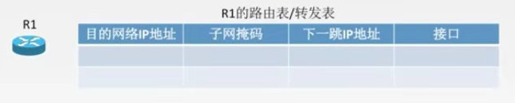

最佳路由：“最佳”只能是相对于某一特定要求下得出的**较为合理地选择**而已。

通常是链路代价最少，跳数最少。

路由算法：

- 静态路由算法（非自适应路由算法）：管理员手工配置路由信息。

  优点：简便，可靠，在符合稳定、拓扑变化不大的网络中运行效果很好，广泛用于高度安全性的军事网络和较小的商业网络。

  缺点：路由更新慢，不适用于大型网络。

- 动态路由算法（自适应路由算法）：路由器之间彼此交换信息，按照路由算法优化出路由表项。

  优点：路由更新快，适用于大型网络，及时响应链路费用或网络拓扑结构。

  缺点：算法复杂，增加网络负担。

- 动态路由算法的属性

  - 全局性：链路状态路由算法：所有路由器掌握完整的网络拓扑和链路费用信息。**OSPF**
  - 分散性：距离向量路由算法：路由器只掌握物理连接的邻居及链路费用。

### 分层次的路由选择协议

1. 因特网规模很大，需要拆分。
2. 许多单位不想让外界知道自己的路由选择协议，还想接入因特网

由以上两点需求，产生了 自治系统 AS : 在单一的技术管理下的一组路由器，这些路由器使用一种AS内部的路由选择协议和共同的度量以确定分组在该 AS 内的路由，同时还使用一种 AS 之间的路由协议以确定在 AS 之间的路由。

现在对自治系统 AS 的定义是强调下面的事实：**尽管一个 AS 使用了多种内部路由选择协议和度量，但重要的是一个 AS 对其他 AS 表现出的是一个单一的和一致的路由选择策略。**

一个 AS 内的所有网络都属于一个行政单位来管辖，一个自治系统的所有路由器在本自治系统都必须连通。

两种路由选择协议：

- 内部网关协议 IGP (Interior Gateway Protocol)  
  1. 在一个自治系统内部使用的路由选择协议。
  2. 目前这类路由选择协议使用得最多，如 RIP 和 OSPF 协议。
- 外部网关协议 EGP (External Gateway Protocol) 
  1. 若源站和目的站处在不同的自治系统中，当数据报传到一个自治系统的边界时，就需要使用一种协议将路由选择信息传递到另一个自治系统中。这样的协议就是外部网关协议 **EGP**。
  2. 在外部网关协议中目前使用最多的是 **BGP-4**。 

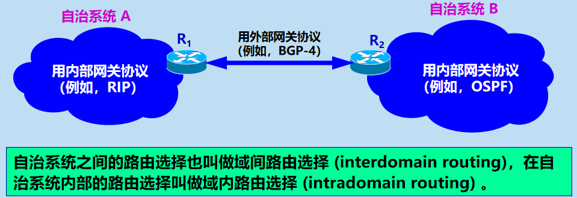

注意：

- 互联网的早期 RFC 文档中未使用“路由器”而是使用“网关”这一名词。但是在新的 RFC 文档中又使用了“路由器”这一名词。应当把这**两个术语当作同义词**。
- **IGP 和 EGP 是协议类别的名称**。但 RFC 在使用 EGP 这个名词时出现了一点混乱，因为最早的一个外部网关协议的协议名字正好也是 EGP。因此在遇到名词 EGP 时，应弄清它是指旧的协议 EGP 还是指外部网关协议 EGP 这个类别。 

### 内部网关协议 RIP

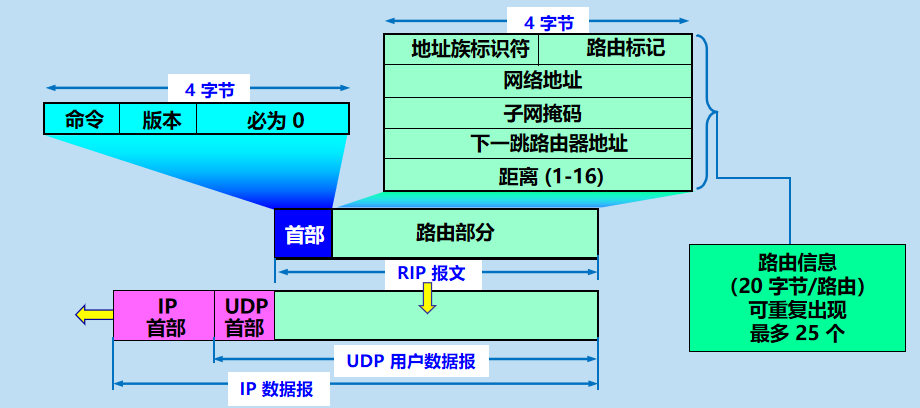

工作原理：

- 路由信息协议 RIP (Routing Information Protocol) 是内部网关协议 IGP 中最先得到广泛使用的协议。
- RIP 是一种**分布式的、基于距离向量的路由选择协议**。
- RIP 协议要求网络中的每一个路由器都要维护从它自己到其他每一个目的网络的距离记录。 

既然 RIP 基于距离，那么问题来了，何为距离呢？

- 从一个路由器到**直接连接**的网络的距离定义为 1。
- 从一个路由器到非直接连接的网络的距离定义为所经过的路由器数加 1。
- **RIP 协议中的“距离”也称为“跳数”(hop count)**，因为每经过一个路由器，跳数就加 1。
- 这里的“距离”实际上指的是**“最短距离”**。 
- RIP 认为一个好的路由就是它通过的**路由器的数目少**，即“距离短”。
- RIP 允许一条路径最多**只能包含 15 个路由器**。
- “距离”的最大值为 16 时即相当于不可达。可见 RIP **只适用于小型互联网**。
- **RIP 不能在两个网络之间同时使用多条路由。**RIP 选择一个具有最少路由器的路由（即最短路由），哪怕还存在另一条高速(低时延)但路由器较多的路由。 

#### RIP 协议的三个特点

- 仅和相邻路由器交换信息。 
- 交换的信息是当前本路由器所知道的全部信息，即自己的路由表。 
- 按固定的时间间隔交换路由信息，例如，每隔 30 秒。当网络拓扑发生变化时，路由器
- 也及时向相邻路由器通告拓扑变化后的路由信息。

路由表的建立：

- 路由器在**刚刚开始工作时**，只知道到直接连接的网络的距离（此距离定义为 1）。**它的路由表是空的**。
- 以后，每一个路由器也只和数目非常有限的相邻路由器交换并更新路由信息。
- 经过若干次更新后，所有的路由器最终都会知道到达本自治系统中任何一个网络的最短距离和下一跳路由器的地址。
- RIP 协议的**收敛 (convergence)** 过程较快。“收敛”就是在自治系统中所有的结点都得到正确的路由选择信息的过程。 

#### RIP 核心：距离向量算法

**路由器收到相邻路由器（其地址为 X）的一个 RIP 报文**：

(1) 先修改此 RIP 报文中的所有项目：把“下一跳”字段中的地址都改为 X，并把所有的“距离”字段的值加 1。
(2) 对修改后的 RIP 报文中的每一个项目，重复以下步骤：
     若项目中的目的网络不在路由表中，则把该项目加到路由表中。
         否则
             若下一跳字段给出的路由器地址是同样的，则把收到的项目替换原路由表中的项目。
                否则 
                    若收到项目中的距离小于路由表中的距离，则进行更新，
	     否则，什么也不做。
(3) 若 3 分钟还没有收到相邻路由器的更新路由表，则把此相邻路由器记为不可达路由器，即将距离置为 16（表示不可达）。
(4) 返回。

距离向量算法的基础就是 Bellman-Ford 算法（或 Ford-Fulkerson 算法）。
这种算法的要点是这样的：

- 设X是结点 A 到 B 的最短路径上的一个结点。
- 若把路径 A→B 拆成两段路径 A→X 和 X→B，则每一段路径 A→X 和 X→B 也都分别是结点 A 到 X 和结点 X 到 B 的最短路径。

#### 路由器之间交换信息与路由表更新

- RIP 协议让互联网中的所有路由器都和自己的相邻路由器不断交换路由信息，并不断更新其路由表，使得从每一个路由器到每一个目的网络的路由都是最短的（即跳数最少）。
- 虽然所有的路由器最终都拥有了整个自治系统的全局路由信息，但由于每一个路由器的位置不同，它们的路由表当然也应当是不同的.

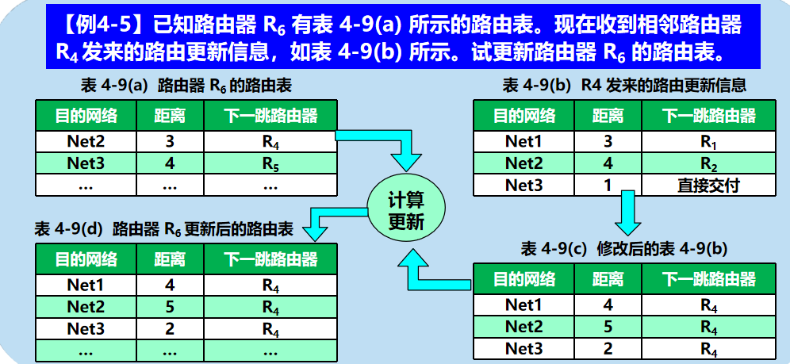

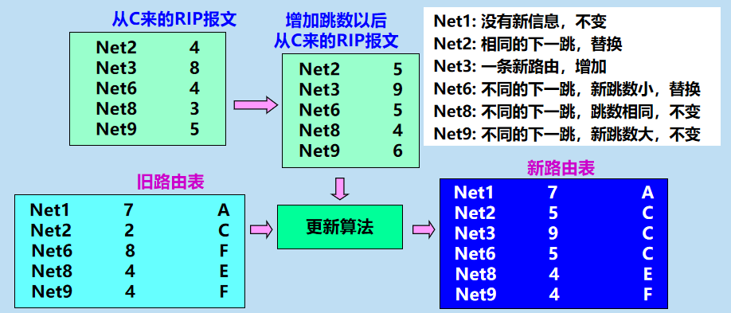

#### RIP 协议特点

- RIP 协议特点：好消息传播得快，坏消息传播得慢。
- RIP 存在的一个问题：当网络出现故障时，要经过比较长的时间 (例如数分钟) 才能将此信息传送到所有的路由器。

过程展示：

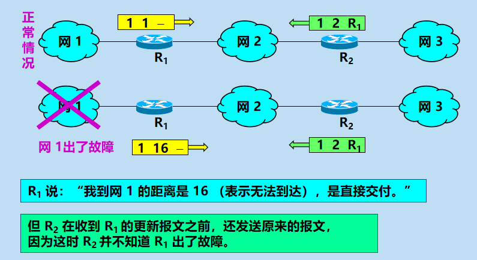

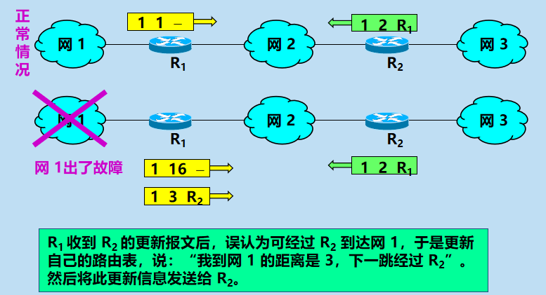

### 内部网关协议 OSPF

开放最短路径优先 OSPF (Open Shortest Path First)是为克服 RIP 的缺点在 1989 年开发出来的。
**OSPF 的原理很简单，但实现起来却较复杂。**

#### OSPF 协议的基本特点

- **“开放**”表明 OSPF 协议不是受某一家厂商控制，而是公开发表的。
- **“最短路径优先”**是因为使用了 Dijkstra 提出的最短路径算法 SPF
- 采用**分布式的链路状态协议** (link state protocol)。 
- 注意：OSPF 只是一个协议的名字，它并不表示其他的路由选择协议不是“最短路径优先”。

#### 三个要点

- **向本自治系统中所有路由器发送信息**，这里使用的方法是洪泛法。
- 发送的信息就是与本路由器相邻的所有路由器的链路状态，但这只是路由器所知道的部分信息。
	- “链路状态”就是说明本路由器都和哪些路由器相邻，以及该链路的“度量”(metric)。 
- 只有当链路状态发生变化时，路由器才用洪泛法向所有路由器发送此信息。

链路状态数据库

- 由于各路由器之间频繁地交换链路状态信息，因此所有的路由器最终都能建立一个链路状态数据库。
- 这个数据库实际上就是**全网的拓扑结构图，它在全网范围内是一致的**（这称为链路状态数据库的同步）。
- OSPF 的链路状态数据库能**较快地进行更新**，使各个路由器能及时更新其路由表。
- OSPF 的更新过程收敛得快是其重要优点。**

## IP 数据报格式

TCP/IP 协议栈

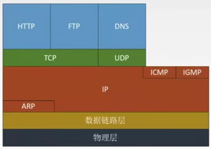

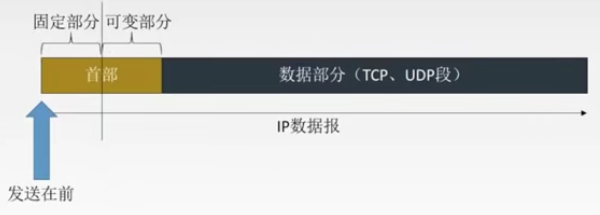

首部格式详细：

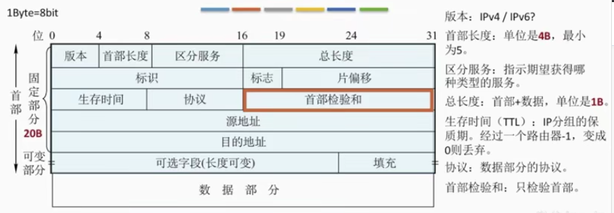

源地址和目的地址都为 32 位地址。

可选字段 的长度为 0~40B, 用来支持排错测量以及安全等措施

填充：全0，把首部填充到 4字节 的整数倍。

## IP 数据报分片

**最大传送单元MTU** ：链路层数据帧可封装的数据上限。以太网的 MTU 是 1500 字节。

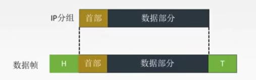

如果所传送的数据就是比 1500 字节大的时候，我们就需要进行分片了。

在标识字段中，同一数据报的分片使用同一标识。

标志：只有两位有意义 x__

中间位 DF 

DF = 1，禁止分片

DF = 0，允许分片

最低位 MF

MF= 1后面还有分片

MF= 0 代表最后一片或没有分片

片偏移：指出较长分组分片后，某篇在原分组中的相对位置，以==8B==为单位。所以除了最后一个分片不一定，其他分片的长度一定是 ==8B的整数倍==。

例题：

第一片的片偏移量为 0

第二片的片偏移量为 1400/8 = 175

第三片的片偏移量为 2800/8 = 350

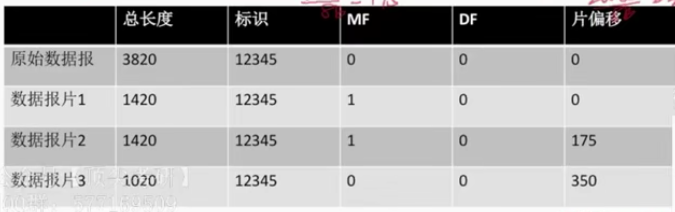

## 网络地址转换(NAT)

私有网络地址：

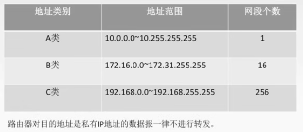

网络地址转换（NAT）：在**专用网**连接到**因特网**的路由器上安装NAT软件，安装了NAT软件的路由器叫**NAT路由器**，他至少有一个有效的**外部全球IP地址。**

## IPv4 地址

IP地址是[IP协议](https://baike.baidu.com/item/IP协议)提供的一种统一的地址格式，它为互联网上的每一个网络和每一台主机分配一个逻辑地址，以此来屏蔽物理地址的差异。

### 分类的 IP 地址

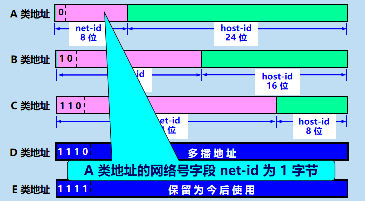

特殊地址：

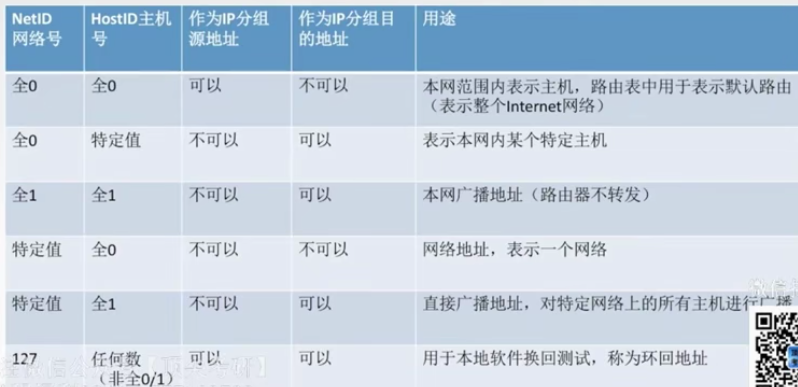

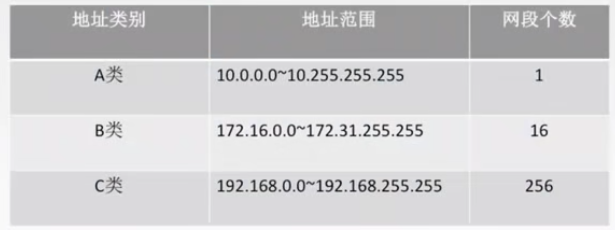

| 网络类别 |          最大可用网络数字           | 第一个可用网络号 | 最后一个可用网络号 | 每个网络中最大主机数 |
| :------: | :---------------------------------: | :--------------: | :----------------: | :------------------: |
|    A     | 2^7^-2(只有A不包括127，所以要减去2) |        1         |        126         |       2^24^-2        |
|    B     |               2^14^-1               |      128.1       |      191.255       |       2^16^-2        |
|    C     |               2^21^-1               |     192.0.1      |    223.255.255     |        2^8^-2        |

## 子网划分与子网掩码

分类IP地址的弱点：

1. IP地址空间的利用率有时很低
2. 两级IP地址不够灵活

以上问题的解决方法就是子网划分。

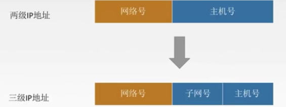

某单位划分子网后，对外仍**表现为一个网络**，即本单位外的网络看不见本单位内子网的划分。子网号是否全0全1要看情况。

### 子网掩码

网络号全1，IP号全写0.

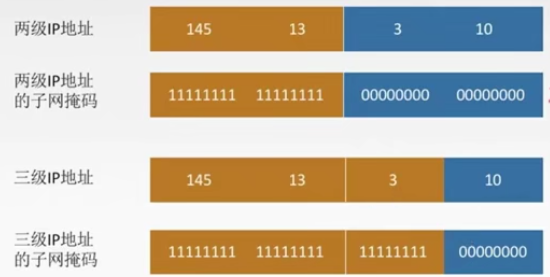

子网掩码与 IP 地址与运算，就能得到子网网络地址。

得到网络地址 145.13.3.0

例题：已知 IP 地址为 141.14.72.24 子网掩码是 255.255.192.0，求网络地址。

**141.14.64.0**

做这类题时可以记住如下的常用二进制。

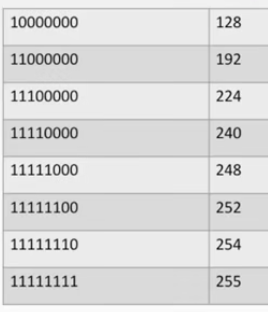

### 使用子网时分组的转发

路由表中：

1. 目的网络地址
2. 目的网络子网掩码
3. 下一跳地址

路由器转发分组的算法：

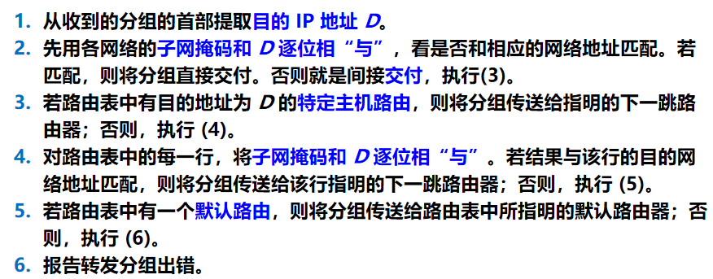

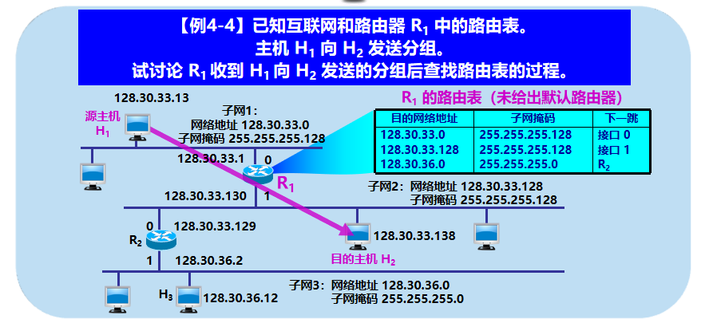

H1 首先检查主机 128.30.33.138 是否连接在本网络上如果是，则直接交付；否则，就送交路由器 R1，并逐项查找路由表。

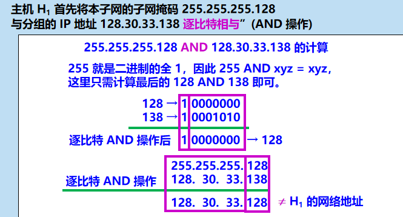

因此 H1 必须把分组传送到路由器 R1然后逐项查找路由表.255.255.255.128 AND 128.30.33.138 = 128.30.33.128     不匹配!（因为128.30.33.128 与路由表中的 128.30.33.0 不一致）

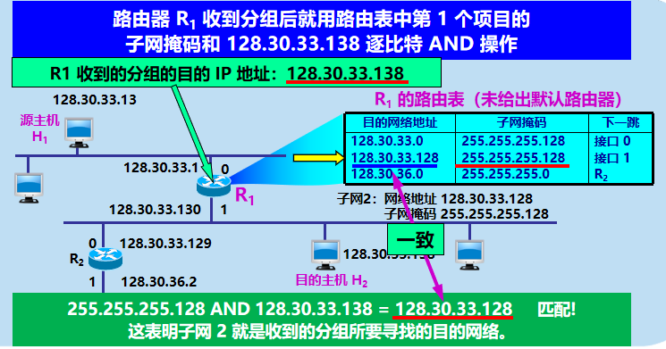

## CIDR 无分类编址

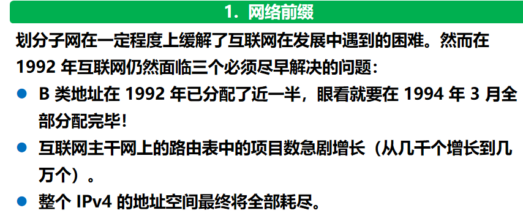

1. CIDR 消除了传统的 A 类、B 类和 C 类地址以及划分子网的概念，因而可以更加有效地分配 IPv4 的地址空间。
2. CIDR使用各种长度的“网络前缀”(network-prefix)来代替分类地址中的网络号和子网号。
3. IP 地址从三级编址（使用子网掩码）又回到了两级编址。

无分类的两级编址的记法是： 

CIDR 使用“斜线记法”(slash notation)，它又称为 CIDR 记法，即在 IP 地址面加上一个斜线“/”，然后写上网络前缀所占的位数（这个数值对应于三级编址中子网掩码中 1 的个数）。例如： 220.78.168.0/24

### CIDR 地址块

- CIDR 把网络前缀都相同的连续的 IP 地址组成**“CIDR 地址块”**。

- 128.14.32.0/20 表示的地址块共有 2^12^ 个地址（因为斜线后面的 20 是网络前缀的位数，所以这个地址的主机号是 12 位）。

  1. 这个地址块的起始地址是 128.14.32.0。
  2. 在不需要指出地址块的起始地址时，也可将这样的地址块简称为**“/20 地址块”**。
  3. 128.14.32.0/20 地址块的最小地址：128.14.32.0
  4. 128.14.32.0/20 地址块的最大地址：128.14.47.255
  5. **全 0 和全 1 的主机号地址一般不使用。**

  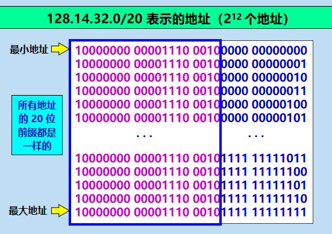

### 路由聚合

- 一个 CIDR 地址块可以表示很多地址，这种地址的聚合常称为路由聚合，它使得路由表中的一个项目可以表示很多个（例如上千个）原来传统分类地址的路由。
- 路由聚合有利于减少路由器之间的路由选择信息的交换，从而提高了整个互联网的性能。
- 路由聚合也称为构成超网 (supernetting)。
- CIDR 虽然不使用子网了，但仍然使用“掩码”这一名词（但不叫子网掩码）。
  对于 /20  地址块，它的掩码是 20 个连续的 1。 斜线记法中的数字就是掩码中1的个数。 

### CIDR 记法的其他形式

- 10.0.0.0/10 可简写为 10/10，也就是把点分十进制中低位连续的 0 省略。

- 10.0.0.0/10 隐含地指出 IP 地址 10.0.0.0 的掩码是 255.192.0.0。此掩码可表示为：

  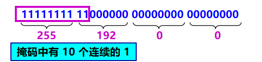

- 网络前缀的后面加一个星号 * 的表示方法，如 00001010 00*，在星号 * 之前是网络前缀，而星号 * 表示 IP 地址中的主机号，可以是任意值。 

### 常用CIDR

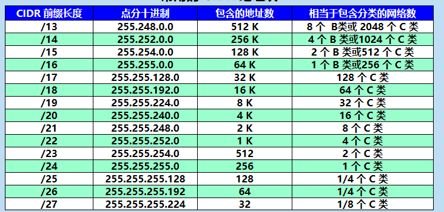

### 构成超网

- 前缀长度不超过 23 位的 CIDR 地址块都包含了多个 C  类地址。
- 这些 C 类地址合起来就构成了超网。
- **CIDR 地址块中的地址数一定是 2 的整数次幂。**
- 网络前缀越短，其地址块所包含的地址数就越多。**而在三级结构的IP地址中，划分子网是使网络前缀变长。**
- CIDR 的一个好处是：可以更加有效地分配 IPv4 的地址空间，可根据客户的需要分配适当大小的 CIDR 地址块。 

举例：

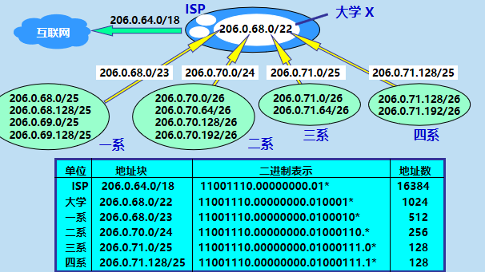

这个 ISP 共有 64 个 C 类网络。如果不采用 CIDR 技术，则在与该 ISP 的路由器交换路由信息的每一个路由器的路由表中，就需要有 64 个项目。但采用地址聚合后，只需用路由聚合后的 1 个项目 206.0.64.0/18 就能找到该 ISP。 

###  最长前缀匹配

- 使用 CIDR 时，路由表中的每个项目由“网络前缀”和“下一跳地址”组成。在查找路由表时**可能会得到不止一个匹配结果**。 

- 应当从匹配结果中选择具有最长网络前缀的路由：**最长前缀匹配** (longest-prefix matching)。

- 网络前缀越长，其地址块就越小，因而路由就越具体 (more specific) 。

  例题：路由器RO的路由表见下表:若进入路由器RO的分组的目的地址为132.19.237.5，请问该分组应该被转发到哪一个下一跳路由器(B ) 。
  A. R1		B.R2		C. R3		D. R4

  |    目的网络     | 下一跳 |
  | :-------------: | :----: |
  |   132.0.0.0/8   |   R1   |
  |  132.0.0.0/11   |   R2   |
  | 132.19.232.0/22 |   R3   |
  |    0.0.0.0/0    |   R4   |

  先看 132.0.0.0/8 是可以匹配的 D可以排除

  132.0.0.0/11 也可以匹配

- 最长前缀匹配又称为**最长匹配或最佳匹配**。

#### 最长前缀匹配举例

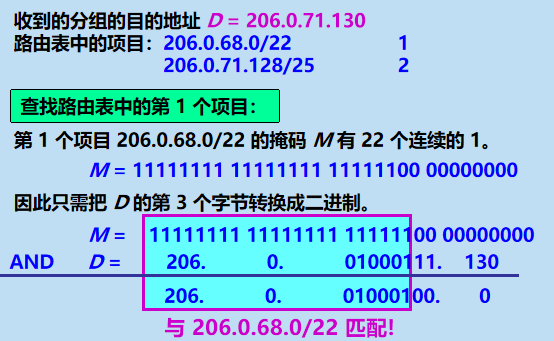

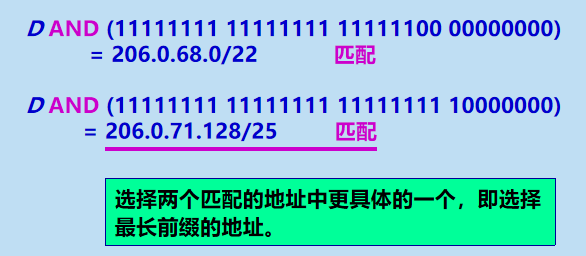

### 使用二叉线索查找路由表

- 当路由表的项目数很大时，怎样设法减小路由表的查找时间就成为一个非常重要的问题。 
- **为了进行更加有效的查找**，通常是将无分类编址的路由表存放在一种层次的数据结构中，然后**自上而下地按层次进行查找**。这里最常用的就是**二叉线索** (binary trie)。
- IP 地址中从左到右的比特值决定了从根结点逐层向下层延伸的路径，而二叉线索中的各个路径就代表路由表中存放的各个地址。
- 为了提高二叉线索的查找速度，广泛使用了各种压缩技术。 

5个前缀构成的二叉线索：

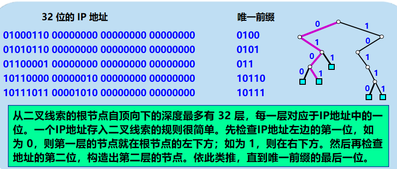

## ARP 协议

**通信时使用了两个地址：**

1. **IP** **地址（网络层地址）**

2. **MAC** **地址（数据链路层地址）**

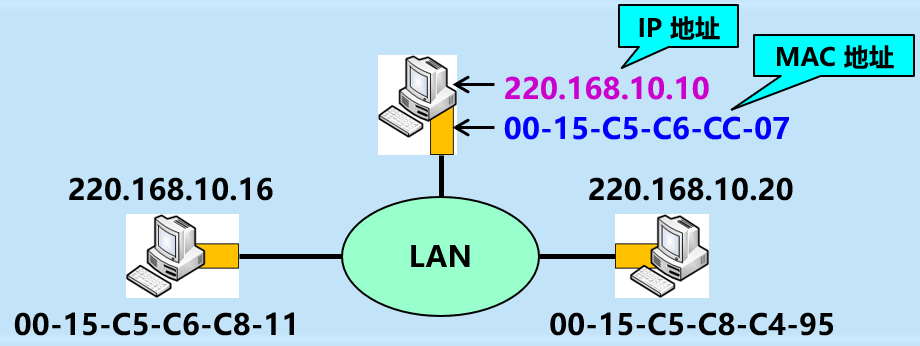

已经知道了一个机器（主机或路由器）的**IP**地址，如何找出其相应的硬件地址？地址解析协议** **ARP** **就是用来解决这样的问题的。

### 地址解析协议 ARP 要点

- 不管网络层使用的是什么协议，在实际网络的链路上传送数据帧时，最终还是必须使用硬件地址。 
- 每一个主机都设有一个 ARP 高速缓存 (ARP cache)，里面有所在的局域网上的各主机和路由器的 IP 地址到硬件地址的映射表。

- 当主机 A 欲向本局域网上的某个主机 B 发送 IP 数据报时，就先在其 ARP 高速缓存中查看有无主机 B 的 IP 地址。
  1. 如有，就可查出其对应的硬件地址，再将此硬件地址写入 MAC 帧，然后通过局域网将该 MAC 帧发往此硬件地址。
  2. 如没有， ARP 进程在本局域网上广播发送一个 ARP 请求分组。收到 ARP 响应分组后，将得到的 IP 地址到硬件地址的映射写入 ARP 高速缓存。

ARP工作的顺序：

1. ARP请求分组：包含发送方硬件地址 / 发送方 IP 地址 / 目标方硬件地址(未知时填 0) / 目标方 IP 地址。

2. 本地广播 ARP 请求（路由器不转发ARP请求）。

3. ARP 响应分组：包含发送方硬件地址 / 发送方 IP地址 / 目标方硬件地址 / 目标方 IP 地址。

4. ARP 分组封装在物理网络的帧中传输。

描述这个过程就是：**检查ARP高速缓存**，有对应表项则写入MAC帧，没有则用目的MAC地址为FF-FF-FF-FF-FF-FF的帧封装并**广播ARP请求分组**，**同一局域网**中所有主机都能收到该请求。目的主机收到请求后就会向源主机**单播一个ARP响应分组**，源主机收到后将此映射写入ARP缓存(10-20min更新一次)。

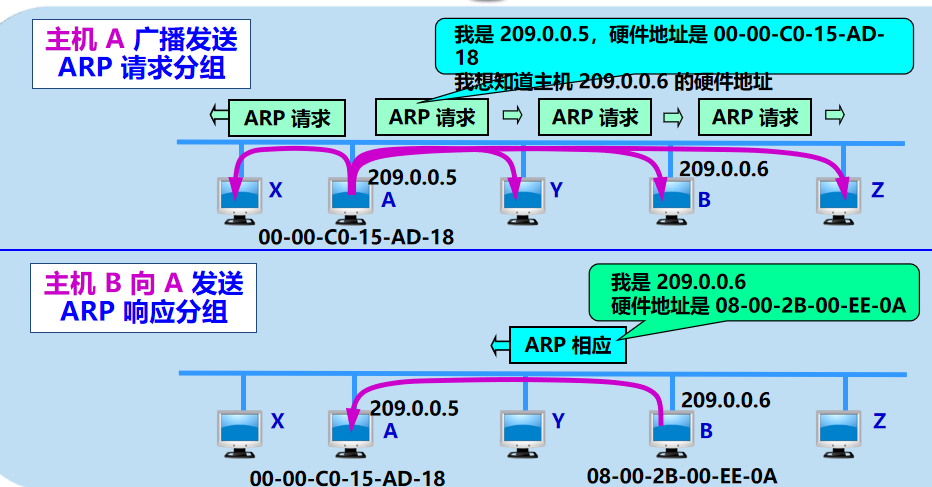

### 应当注意的问题

- ARP 用于解决同一个局域网上的主机或路由器的 IP 地址和硬件地址的映射问题。
- 如果所要找的主机和源主机不在同一个局域网上，那么就要**通过 ARP 找到一个位于本局域网上的某个路由器的硬件地址**，然后把分组发送给这个路由器，让这个路由器把分组转发给下一个网络。剩下的工作就由下一个网络来做。
- 从 IP 地址到硬件地址的解析是**自动进行的**，主机的用户对这种地址解析过程是不知道的。
- 只要主机或路由器要和本网络上的另一个已知 IP 地址的主机或路由器进行通信，ARP 协议就会自动地将该 IP 地址解析为链路层所需要的硬件地址。 

### 使用ARP协议的四种典型情况

1. 主机A发给本网络上的主机B:用ARP找 到主机B的硬件地址:
2. 主机A发给另一网络上的主机B:用ARP找到本网络上-一个路由器(网关)的硬件地址;
3. 路由器发给本网络的主机A:用ARP找到主 机A的硬件地址:
4. 路由器发给另一网络的主机B:用ARP找到本网络 上的一个路由器的硬件地址。

例题：主机发送IP数据报给主机B，经过5个路由器，这个过程中使用了几次ARP协议？

6次，主机一次，路由器五次

## DHCP协议（应用层协议）

问题：IP地址如何分配？

1. 静态配置：管理员手动设置每台主机的IP地址，子网掩码，默认网关。
2. 动态配置：通过DHCP协议自动分发IP地址。

动态主机配置协议DHCP是**应用层协议**，使用**客户/服务器**方式，客户端和服务端通过**广播**方式进行交互，**基于UDP**。

DHCP提供**即插即用**联网的机制，主机可以从服务器动态获取IP地址、子网掩码、默认网关、DNS服务器名称与IP地址，允许**地址重用**，支持**移动用户加入网络**，支持在用**地址续租**。

1. 主机广播DHCP提供报文 ，有没有服务器鸭？
2. DHCP服务器广播DHCP提供报文，有有有！，服务器分配一个IP地址，先到先得
3. 主机广播DHCP请求报文，”我用上了！“
4. DHCP服务器广播DHCP确认报文，”用吧！“

## ICMP协议

ICMP协议支持主机或路由器，主要功能是差错报告和网络探询。

- 为了更有效地转发 IP 数据报和提高交付成功的机会，在网际层使用了网际控制报文协议 ICMP (Internet Control Message Protocol)。
- ICMP 是互联网的标准协议。
- ICMP 允许主机或路由器报告差错情况和提供有关异常情况的报告。
- 但 ICMP 不是高层协议（看起来好像是高层协议，因为 ICMP 报文是装在 IP 数据报中，作为其中的数据部分），而是 IP 层的协议。

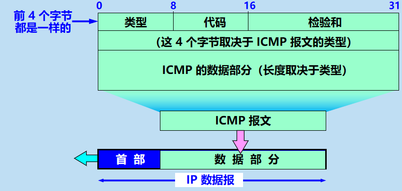

### ICMP 报文的种类

- ICMP 报文的种类有两种，即 ICMP **差错报告报文**和 ICMP **询问报文**。 
- ICMP 报文的前 4 个字节是统一的格式，共有三个字段：即**类型、代码和检验和**。接着的 4 个字节的内容与 ICMP 的类型有关。

#### ICMP 差错报告报文的种类

1. 终点不可达 :当路由器或主机不能交付数据报时就向源点发送终点不可达报文。**无法交付**
2. 时间超过 ：当路由器收到生存时间TTL=0的数据报时，除丢弃数据报外，还要向源点发送时间超过报文。当终点在预先规定的时间内不能收到一个数据报的全部数据报片时，就把已经收到的数据报片都丢弃，并向源点发送时间超过报文。**TTL=0.**
3. 参数问题 ： 当路由器或目的主机收到的数据报的首部中有的字段的值不正确时，丢弃该数据报，并向源点发送参数问题报文。**首部字段出问题**
4. 改变路由（重定向）(Redirect) 路由器把改变路由报文发给主机，让主机知道下次应该把数据报发送给另外的路由器（可通过更好的路由）。

### ICMP 差错报告报文的数据字段的内容

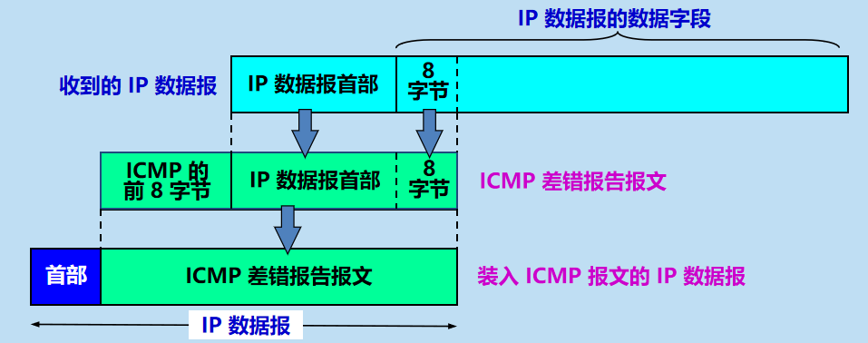

不应发送 ICMP 差错报告报文的几种情况:

1. 对 **ICMP 差错报告报文**不再发送 ICMP 差错报告报文。
2. 对第一个分片的数据报片的所有**后续数据报片**都不发送 ICMP 差错报告报文。
3. 对具有**多播地址的数据报**都不发送 ICMP 差错报告报文。
4. 对具有特殊地址（如127.0.0.0 或 0.0.0.0）的数据报不发送 ICMP 差错报告报文。

#### ICMP 询问报文

- 回送请求和回答报文
- 时间戳请求和回答报文

下面的几种 ICMP 报文不再使用：

- 信息请求与回答报文
- 掩码地址请求和回答报文
- 路由器询问和通告报文 
- 源点抑制报文

### ICMP 的应用举例

- PING：PING (Packet InterNet Groper) 

  - PING 用来测试两个主机之间的连通性。
  - PING 使用了 ICMP 回送请求与回送回答报文。
  - PING 是应用层直接使用网络层 ICMP 的例子，它没有通过运输层的 TCP 或UDP。

  

- Traceroute 的应用举例

  - 在 Windows 操作系统中这个命令是 tracert。
  - 用来跟踪一个分组从源点到终点的路径。
  - 它利用 IP 数据报中的 TTL 字段和 ICMP 时间超过差错报告报文实现对从源点到终点的路径的跟踪。

  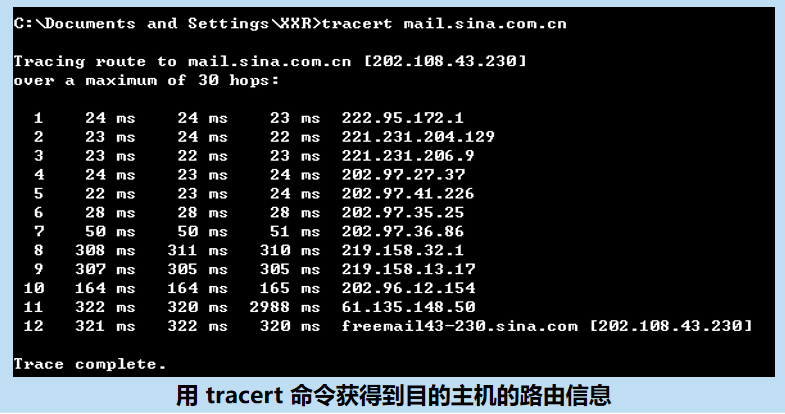

