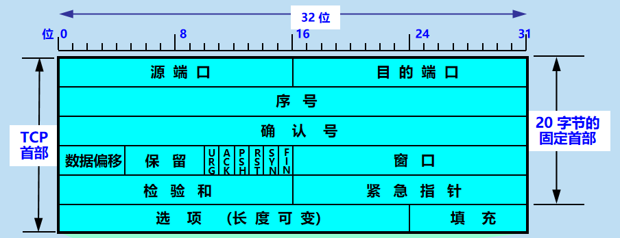

# 第 5 章  运输层

## 运输层协议概述
### 进程之间的通信
* 运输层向它上面的应用层提供通信服务，它属于面向通信部分的最高层，同时也是用户功能中的最低层。
* 两个主机进行通信实际上就是两个主机中的应用进程互相通信。 
* 应用进程之间的通信又称为端到端的通信。 
* 运输层协议和网络层协议的主要区别 
### 网络层与运输层的区别

### 运输层的两个主要协议
* (1) 用户数据报协议 UDP(User Datagram Protocol)
    * UDP 传送的数据单位协议是 UDP 报文或用户数据报。 
* (2) 传输控制协议 TCP(Transmission Control Protocol)
    * TCP 传送的数据单位协议是 TCP 报文段(segment)
* 当运输层采用面向连接的 TCP 协议时，尽管下面的网络是不可靠的（只提供尽最大努力服务），但这种逻辑通信信道就相当于**一条全双工的可靠信道。**
* 当运输层采用无连接的 UDP 协议时，这种逻辑通信信道是**一条不可靠信道。** 
### 运输层的端口
* 软件端口与硬件端口
    * 在协议栈层间的抽象的协议端口是软件端口。
    * 路由器或交换机上的端口是硬件端口。
* 三类端口
    * 熟知端口，数值一般为 0~1023。
    * 登记端口号，数值为1024~49151，为没有熟知端口号的应用程序使用的。使用这个范围的端口号必须在 IANA 登记，以防止重复。
    * 客户端口号或短暂端口号，数值为49152~65535，留给客户进程选择暂时使用。当服务器进程收到客户进程的报文时，就知道了客户进程所使用的动态端口号。通信结束后，这个端口号可供其他客户进程以后使用。
## 用户数据报协议 UDP 
### UDP 概述
* 用户数据报协议 UDP（User Datagram Protocol）是无连接的，尽最大可能交付，没有拥塞控制，面向报文（对于应用程序传下来的报文不合并也不拆分，只是添加 UDP 首部），支持一对一、一对多、多对一和多对多的交互通信。
* UDP 只在 IP 的数据报服务之上增加了很少一点的功能：
  - 复用和分用的功能
  - 差错检测的功能
### UDP 的首部格式

### UDP 的主要特点

- UDP 是无连接的，发送数据之前不需要建立连接，，因此减少了开销和发送数据之前的时延。
- UDP 使用尽最大努力交付，即不保证可靠交付，因此主机不需要维持复杂的连接状态表。
- UDP 是面向报文的。UDP 对应用层交下来的报文，既不合并，也不拆分，而是保留这些报文的边界。UDP 一次交付一个完整的报文。
- UDP 没有拥塞控制，因此网络出现的拥塞不会使源主机的发送速率降低。这对某些实时应用是很重要的。很适合多媒体通信的要求。 
- UDP 支持一对一、一对多、多对一和多对多的交互通信。
- UDP 的首部开销小，只有 8 个字节，比 TCP 的 20 个字节的首部要短。

## 传输控制协议 TCP 概述
### TCP 最主要的特点
* TCP 是面向连接的运输层协议，在无连接的、不可靠的 IP 网络服务基础之上提供可靠交付的服务。为此，在 IP 的数据报服务基础之上，增加了保证可靠性的一系列措施。
* TCP 是面向连接的运输层协议。
* 每一条 TCP 连接只能有两个端点 (endpoint)，每一条 TCP 连接只能是点对点的（一对一）。 
* TCP 提供可靠交付的服务。
* TCP 提供全双工通信。
* 面向字节流
  1. TCP 中的“流”(stream) 指的是流入或流出进程的字节序列。
  2. “面向字节流”的含义是：虽然应用程序和 TCP 的交互是一次一个数据块，但 TCP 把应用程序交下来的数据看成仅仅是一连串无结构的字节流。
### TCP 面向流的概念

- TCP 不保证接收方应用程序所收到的数据块和发送方应用程序所发出的数据块具有对应大小的关系。
- 但接收方应用程序收到的字节流必须和发送方应用程序发出的字节流完全一样。

### 注 意

- TCP 连接是一条虚连接而不是一条真正的物理连接。
- TCP 对应用进程一次把多长的报文发送到 TCP 的缓存中是不关心的。
- TCP 根据对方给出的窗口值和当前网络拥塞的程度来决定一个报文段应包含多少个字节（UDP 发送的报文长度是应用进程给出的）。
- TCP 可把太长的数据块划分短一些再传送。
- TCP 也可等待积累有足够多的字节后再构成报文段发送出去。 

### TCP 的连接

- TCP 把连接作为最基本的抽象。
- 每一条 TCP 连接有两个端点。
- TCP 连接的端点不是主机，不是主机的IP 地址，不是应用进程，也不是运输层的协议端口。TCP 连接的端点叫做套接字 (socket) 或插口。

* TCP 连接的端点叫做套接字(socket)或插口。
    * 套接字 socket = (IP地址: 端口号) 

## 可靠传输的工作原理
### 停止等待协议

- “停止等待”就是每发送完一个分组就停止发送，等待对方的确认。在收到确认后再发送下一个分组。

- 全双工通信的双方既是发送方也是接收方。

- 为了讨论问题的方便，我们仅考虑 A 发送数据，而 B 接收数据并发送确认。因此 A 叫做发送方，而 B 叫做接收方。下图是无差错情况：

  

- 在接收方 B 会出现两种情况：

  - B 接收 M1 时检测出了差错，就丢弃 M1，其他什么也不做（不通知 A 收到有差错的分组）。

    **此时的解决方法为：超时重传。**

    1. A 为每一个已发送的分组都设置了一个超时计时器。
    2. A 只要在超时计时器到期之前收到了相应的确认，就撤销该超时计时器，继续发送下一个分组 M2 。
    3. 若A在超时计时器规定时间内没有收到B的确认，就认为分组错误或丢失，就重发该分组。

  - M1 在传输过程中丢失了，这时 B 当然什么都不知道，也什么都不做。

    **解决方法：编号**

    1. A为每一个发送的分组都进行编号。若B收到了编号相同的分组，则认为收到了重复分组，丢弃重复的分组，并回送确认。
    2. B为发送的确认也进行编号，指示该确认是对哪一个分组的确认。
    3. A根据确认及其编号，可以确定它是对哪一个分组的确认，避免重发发送。若为重复的确认，则将其丢弃。

  在这两种情况下，B 都不会发送任何信息。

  但A都必须重发分组，直到B正确接收为止，这样才能实现可靠通信。

  

- 确认丢失

  1. 若 B 所发送的对 M1 的确认丢失了，那么 A 在设定的超时重传时间内不能收到确认，但 A 并无法知道：是自己发送的分组出错、丢失了，或者 是 B 发送的确认丢失了。因此 A 在超时计时器到期后就要重传 M1。
  2. 假定 B 又收到了重传的分组 M1。这时 B 应采取两个行动：
     - 第一，丢弃这个重复的分组 M1，不向上层交付。
     - 第二，向 A 发送确认。不能认为已经发送过确认就不再发送，因为 A 之所以重传 M1 就表示 A 没有收到对 M1 的确认。

- 确认迟到

  1. 传输过程中没有出现差错，但 B 对分组 M1 的确认迟到了。
  2. A 会收到重复的确认。对重复的确认的处理很简单：收下后就丢弃。
  3. B 仍然会收到重复的 M1，并且同样要丢弃重复的 M1，并重传确认分组。

  

### 自动重传请求 ARQ

- 通常 A 最终总是可以收到对所有发出的分组的确认。如果 A 不断重传分组但总是收不到确认，就说明通信线路太差，不能进行通信。
- 使用上述的确认和重传机制，我们就可以在不可靠的传输网络上实现可靠的通信。
- 像上述的这种可靠传输协议常称为自动重传请求 ARQ  (Automatic Repeat reQuest)。意思是重传的请求是自动进行的，接收方不需要请求发送方重传某个出错的分组。

#### 信道利用率

- 可以看出，当往返时间 RTT 远大于分组发送时间 TD 时，信道的利用率就会非常低。

- 若出现重传，则对传送有用的数据信息来说，信道的利用率就还要降低。

这时我们可以通过流水线传输的方式提高信道利用率。

- 为了提高传输效率，发送方可以不使用低效率的停止等待协议，而是采用流水线传输。
- 流水线传输就是发送方可连续发送多个分组，不必每发完一个分组就停顿下来等待对方的确认。这样可使信道上一直有数据不间断地传送。
- 由于信道上一直有数据不间断地传送，这种传输方式可获得很高的信道利用率。 

#### 总结停止等待协议

- 停止等待。发送方每次只发送一个分组。在收到确认后再发送下一个分组。
- 编号。对发送的每个分组和确认都进行编号。
- 自动重传请求。发送方为每个发送的分组设置一个超时计时器。若超时计时器超时，发送方会自动重传分组。
- 简单，但信道利用率太低。

### 连续 ARQ 协议

- 发送方一次可以发出多个分组。
- 使用滑动窗口协议控制发送方和接收方所能发送和接收的分组的数量和编号。
- 每收到一个确认，发送方就把发送窗口向前滑动。
- 接收方一般采用累积确认的方式。
- 采用回退N（Go-Back-N）方法进行重传。

#### 滑动窗口

发送窗口：发送方维持一组连续地允许发送的帧的序号。

接收窗口：接收方维持一组连续地允许接收帧的序号。

GBN 发送方必须相应的三件事

1. 上层的调用

   上层要发送数据时，发送方先检查发送窗口是否已满，**如果未满**，则产生一个帧并将其发送，**如果窗口已满**，发送方只需将数据返回给上层，暗示上层窗口已满。上层等一会再发送。( 实际实现中，发送方可以缓存这些数据，窗口不满时再发送帧)。

2. 收到了一个 ACK

   GBN协议中，对 n 号帧的确认采用==累积确认==的方式，标明接收方已经收到 n 号帧和它之前的全部帧。

3. 超时事件

   协议的名字为后退N帧 / 回退N帧，来源于出现丢失和时延过长帧时发送方的行为。就像在停等协议中一样，定时器将再次用于恢复数据帧或确认帧的丢失。如果出现超时，发送方重传所有已发送但未被确认的帧。

GBN 接收方要做的事：

- **如果正确收到 n 号帧**，并且按序，那么接收方为 n 帧发送一个ACK，并将该帧中的数据部分交付给上层。
- **其余情况都丢弃帧**，并为最近按序接收的帧重新发送ACK。接收方无需缓存任何失序帧，只需要维护一个信息: expectedseqnum (下一个按序接收的帧序号)。

运行中的GBN实例

出现超时：发送方重传所有已发送但未被确认的帧。

滑动窗口长度：

==窗口长度可以无限吗？==

不可以，若采用 n 个比特对帧编号，那么发送窗口的尺寸W~T~ 应满足：$1 \leq W_T \leq 2^n - 1$。因为如果发送窗口过大，就会导致接收方无法区别新帧和旧帧。

##### 重点总结

1. 累计确认（偶尔捎带确认）。
2. 接收方只按顺序接收帧，不按序直接丢弃。
3. 确认序列号最大的，按序到达的帧。
4. 发送窗口最大为 2 ^n^ - 1, 接收窗口大小为 1。

因为累积确认，所以 1 是确认到的。所以只要重发 4 帧。

##### GBN 协议性能分析

优点：因连续发送数据帧而提高了信道利用率。

缺点：在重传时必须把原来已经正确传送的数据帧重传，使传送效率降低。

选择重传协议来解决 GBN 的缺点。

## TCP 报文段的首部格式

序号 ：用于对字节流进行编号，例如序号为 301，表示第一个字节的编号为 301，如果携带的数据长度为 100 字节，那么下一个报文段的序号应为 401。

确认号 ：期望收到的下一个报文段的序号。例如 B 正确收到 A 发送来的一个报文段，序号为 501，携带的数据长度为 200 字节，因此 B 期望下一个报文段的序号为 701，B 发送给 A 的确认报文段中确认号就为 701。
数据偏移 ：指的是数据部分距离报文段起始处的偏移量，实际上指的是首部的长度。
确认 ACK ：当 ACK=1 时确认号字段有效，否则无效。TCP 规定，在连接建立后所有传送的报文段都必须把 ACK 置 1。
同步 SYN ：在连接建立时用来同步序号。当 SYN=1，ACK=0 时表示这是一个连接请求报文段。若对方同意建立连接，则响应报文中 SYN=1，ACK=1。
终止 FIN ：用来释放一个连接，当 FIN=1 时，表示此报文段的发送方的数据已发送完毕，并要求释放连接。
窗口 ：窗口值作为接收方让发送方设置其发送窗口的依据。之所以要有这个限制，是因为接收方的数据缓存空间是有限的。

## TCP 可靠传输的实现

###  以字节为单位的滑动窗口    

* 窗口是缓存的一部分，用来暂时存放字节流。发送方和接收方各有一个窗口，接收方通过 TCP 报文段中的窗口字段告诉发送方自己的窗口大小，发送方根据这个值和其它信息设置自己的窗口大小。

发送窗口内的字节都允许被发送，接收窗口内的字节都允许被接收。如果发送窗口左部的字节已经发送并且收到了确认，那么就将发送窗口向右滑动一定距离，直到左部第一个字节不是已发送并且已确认的状态；接收窗口的滑动类似，接收窗口左部字节已经发送确认并交付主机，就向右滑动接收窗口。

接收窗口只会对窗口内最后一个按序到达的字节进行确认，例如接收窗口已经收到的字节为 {31, 34, 35}，其中 {31} 按序到达，而 {34, 35} 就不是，因此只对字节 31 进行确认。发送方得到一个字节的确认之后，就知道这个字节之前的所有字节都已经被接收。

### 选择重传协议

可不可以只重传出错的帧？

解决办法：设置单个确认，同时加大接收窗口，设置接收缓存，缓存乱序到达的帧。

选择重传协议的滑动窗口：

SR 发送方必须响应的三件事：

1. 上层的调用

   从上层收到数据后，SR发送方检查下一个可用于该帧的序号，如果序号位于发送窗口内，则发送数据帧；否则就像GBN一样，要么将数据**缓存**，要么**返回给上层之后再传输。**

2. 收到了一个 ACK

   如果收到ACK，加入该帧序号在窗口内，则 SR 发送方将那个被确认的帧标记为已接收。如果该帧序号是窗口的下界(最左边第一个窗口对应的序号)，则窗口向前移动到具有最小序号的未确认帧处。如果窗口移动了并且有序号在窗口内的未发送帧，则发送这些帧。

3. 超时事件

   每个帧都有自己的定时器，一个超时事件发生后**只重传一个帧**。

SR 接收方要做的事：

来者不拒（窗口内的帧）

SR接收方将**确认一个正确接收的帧**而==不管其是否按序==。失序的帧将被==缓存==，并返回给发送方一个该帧的确认帧**[收谁确认谁]**，直到所有帧(即序号更小的帧)皆被收到为止，这时才可以将一批帧按序交付给上层，然后**向前移动滑动窗口**。

如果收到了窗口序号外（小于窗口下界）的帧，就返回一个 ACK。其他情况就忽略该帧。

##### 运行中的 SR 实例

滑动窗口可以长度无限吗？

不可以。发送窗口最好等于接收窗口。（大了会溢出，小了没意义）

$W_{Tmax} = W_{Rmax} = 2^{n-1}$

##### SR 协议总结

1. 对数据帧逐一确认，收一个确认一个。
2. 只重传出错帧。
3. 接收方有缓存。
4. 窗口长度有限 $W_{Tmax} = W_{Rmax} = 2^{n-1}$。

0,2 超时，3没超时，所以不用重传。

答案为 2。

### 超时重传时间的选择
* 超时重传
    * TCP 使用超时重传来实现可靠传输：如果一个已经发送的报文段在超时时间内没有收到确认，那么就重传这个报文段。

一个报文段从发送再到接收到确认所经过的时间称为往返时间 RTT，加权平均往返时间 RTTs 计算如下：
    * 其中，0 ≤ a ＜ 1，RTTs 随着 a 的增加更容易受到 RTT 的影响。

超时时间 RTO 应该略大于 RTTs，TCP 使用的超时时间计算如下：（其中 RTTd 为偏差的加权平均值）
### 选择确认 SACK

问题：若收到的报文段无差错，只是未按序号，中间还缺少一些序号的数据，那么能否设法只传送缺少的数据而不重传已经正确到达接收方的数据？

答案是可以的。选择确认 SACK  (Selective ACK) 就是一种可行的处理方法。

- 如果要使用选择确认，那么在建立 TCP 连接时，就要在 TCP 首部的选项中加上“允许 SACK”的选项，而双方必须都事先商定好。
- 如果使用选择确认，那么原来首部中的“确认号字段”的用法仍然不变。只是以后在 TCP 报文段的首部中都增加了 SACK 选项，以便报告收到的不连续的字节块的边界。
- 由于首部选项的长度最多只有 40 字节，而指明一个边界就要用掉 4 字节，因此在选项中最多只能指明 4 个字节块的边界信息。

## TCP的流量控制
### 利用滑动窗口实现流量控制
* TCP 流量控制
    * 流量控制是为了控制发送方发送速率，保证接收方来得及接收。

接收方发送的确认报文中的窗口字段可以用来控制发送方窗口大小，从而影响发送方的发送速率。将窗口字段设置为 0，则发送方不能发送数据。
* 流量控制举例
### 必须考虑传输效率
## TCP 的拥塞控制
### 拥塞控制的一般原理
* 如果网络出现拥塞，分组将会丢失，此时发送方会继续重传，从而导致网络拥塞程度更高。因此当出现拥塞时，应当控制发送方的速率。这一点和流量控制很像，但是出发点不同。流量控制是为了让接收方能来得及接收，而拥塞控制是为了降低整个网络的拥塞程度。
* 拥塞控制所起的作用
### 几种拥塞控制方法
* TCP 主要通过四个算法来进行拥塞控制：慢开始、拥塞避免、快重传、快恢复。
    * 发送方需要维护一个叫做拥塞窗口（cwnd）的状态变量，注意拥塞窗口与发送方窗口的区别：拥塞窗口只是一个状态变量，实际决定发送方能发送多少数据的是发送方窗口。

为了便于讨论，做如下假设：

接收方有足够大的接收缓存，因此不会发生流量控制；
虽然 TCP 的窗口基于字节，但是这里设窗口的大小单位为报文段。

1. 慢开始与拥塞避免

   * 发送的最初执行慢开始，令 cwnd = 1，发送方只能发送 1 个报文段；当收到确认后，将 cwnd 加倍，因此之后发送方能够发送的报文段数量为：2、4、8 ...

     注意到慢开始每个轮次都将 cwnd 加倍，这样会让 cwnd 增长速度非常快，从而使得发送方发送的速度增长速度过快，网络拥塞的可能性也就更高。设置一个慢开始门限 ssthresh，当 cwnd >= ssthresh 时，进入拥塞避免，每个轮次只将 cwnd 加 1。

     如果出现了超时，则令 ssthresh = cwnd / 2，然后重新执行慢开始。

2. 快重传与快恢复

   - 在接收方，要求每次接收到报文段都应该对最后一个已收到的有序报文段进行确认。例如已经接收到 M1 和 M2，此时收到 M4，应当发送对 M2 的确认。

     在发送方，如果收到三个重复确认，那么可以知道下一个报文段丢失，此时执行快重传，立即重传下一个报文段。例如收到三个 M2，则 M3 丢失，立即重传 M3。

     在这种情况下，只是丢失个别报文段，而不是网络拥塞。因此执行快恢复，令 ssthresh = cwnd / 2 ，cwnd = ssthresh，注意到此时直接进入拥塞避免。

     慢开始和快恢复的快慢指的是 cwnd 的设定值，而不是 cwnd 的增长速率。慢开始 cwnd 设定为 1，而快恢复 cwnd 设定为 ssthresh。

一图流：

###  随机早期检测 RED

  

已经被废弃，不好用。

## TCP 的运输连接管理
### TCP 的连接建立
* 假设 A 为客户端，B 为服务器端。

首先 B 处于 LISTEN（监听）状态，等待客户的连接请求。

A 向 B 发送连接请求报文，SYN=1，ACK=0，选择一个初始的序号 x。

B 收到连接请求报文，如果同意建立连接，则向 A 发送连接确认报文，SYN=1，ACK=1，确认号为 x+1，同时也选择一个初始的序号 y。

A 收到 B 的连接确认报文后，还要向 B 发出确认，确认号为 y+1，序号为 x+1。

B 收到 A 的确认后，连接建立。
* 三次握手的原因
    * 第三次握手是为了防止失效的连接请求到达服务器，让服务器错误打开连接。

客户端发送的连接请求如果在网络中滞留，那么就会隔很长一段时间才能收到服务器端发回的连接确认。客户端等待一个超时重传时间之后，就会重新请求连接。但是这个滞留的连接请求最后还是会到达服务器，如果不进行三次握手，那么服务器就会打开两个连接。如果有第三次握手，客户端会忽略服务器之后发送的对滞留连接请求的连接确认，不进行第三次握手，因此就不会再次打开连接。

### TCP 的连接释放
* 以下描述不讨论序号和确认号，因为序号和确认号的规则比较简单。并且不讨论 ACK，因为 ACK 在连接建立之后都为 1。

A 发送连接释放报文，FIN=1。

B 收到之后发出确认，此时 TCP 属于半关闭状态，B 能向 A 发送数据但是 A 不能向 B 发送数据。

当 B 不再需要连接时，发送连接释放报文，FIN=1。

A 收到后发出确认，进入 TIME-WAIT 状态，等待 2 MSL（最大报文存活时间）后释放连接。

B 收到 A 的确认后释放连接。
* 四次挥手的原因
    * 客户端发送了 FIN 连接释放报文之后，服务器收到了这个报文，就进入了 CLOSE-WAIT 状态。这个状态是为了让服务器端发送还未传送完毕的数据，传送完毕之后，服务器会发送 FIN 连接释放报文。
* TIME_WAIT
    * 客户端接收到服务器端的 FIN 报文后进入此状态，此时并不是直接进入 CLOSED 状态，还需要等待一个时间计时器设置的时间 2MSL。这么做有两个理由：
        * 确保最后一个确认报文能够到达。如果 B 没收到 A 发送来的确认报文，那么就会重新发送连接释放请求报文，A 等待一段时间就是为了处理这种情况的发生。
        * 等待一段时间是为了让本连接持续时间内所产生的所有报文都从网络中消失，使得下一个新的连接不会出现旧的连接请求报文。

### TCP 的有限状态机 
* 粗实线箭头表示对客户进程的正常变迁。
粗虚线箭头表示对服务器进程的正常变迁。
另一种细线箭头表示异常变迁。

